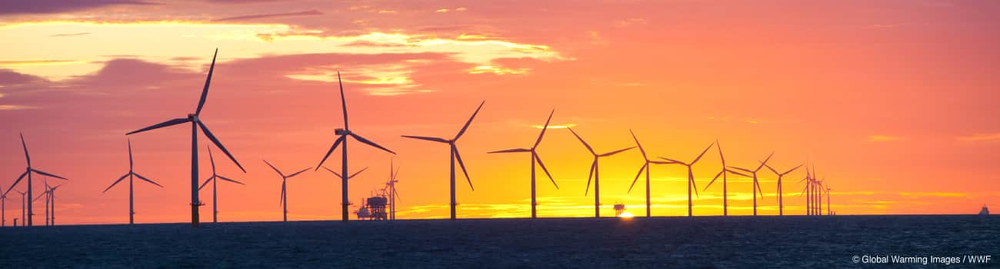

---
output:
  html_document:
    highlight: tango
    theme: paper
    toc: yes
    depth: 4
    number_sections: true
    code_folding: hide
  pdf_document:
    highlight: tango
    theme: paper
    toc: yes
    depth: 4
    number_sections: true
---

```{r global_functions, include = FALSE, echo=TRUE}

# -----------------------------------
# General Notes about the code
# -----------------------------------
# 1) The Try-Catch blocks are only necessary for live data sources pulled from
#   the internet directly, whereby the validity of the data cannot be
#   guaranteed at runtime. They are still left in the code below even though
#   the data sources are being loaded locally.
# 2) All code chunks follow the same pattern as defined by the following
#   pseudocode:
#   - Set data source filename
#   - Run Load_data function, passing through filename, and returning loaded
#     dataframe
#   - Run 'cleanup' munging function, passing through dataframe
#   - Run ggplot block, passing through dataframe
# -----------------------------------

# Display numbers up to 10 positions without showing the exponent
options("scipen" = 10)

# -----------------------------------
# Global Functions
# -----------------------------------

# 
load_data <- function(filename,
                      fileType = "txt",
                      sheet="Sheet1",
                      pattern = "",
                      delimiter = ",",
                      skipLines = 0,
                      blankLinesSkip = TRUE,
                      includeHeader = TRUE){
  
  # -----------------------------------
  # Function to load different kinds of files based on parameters passed
  # (csv, txt, xls). Also converts standard dataframe type into a dplyr
  # table dataframe.
  # -----------------------------------
  
  result <- tryCatch({
    
    if(fileType == "txt"){
      table <- tbl_df(read.csv(
                        filename,
                        sep = delimiter,
                        skip = skipLines,
                        stringsAsFactors = FALSE,
                        blank.lines.skip = blankLinesSkip,
                        header = includeHeader))
    }
    else {
      table <- tbl_df(read.xls(filename,
                                pattern = pattern,
                                sheet = sheet))
    }
    
    return(table)
    
  }, error = function(e){
    
    print("Unfortunately the data couldn't be loaded: ", e)
    
    return(FALSE)
  })
  
  return(result)
}

# -----------------------------------
# Multiple plot function
# -----------------------------------
# URL: http://www.cookbook-r.com/Graphs/Multiple_graphs_on_one_page_(ggplot2)/
#
# ggplot objects can be passed in ..., or to plotlist
# (as a list of ggplot objects)
# - cols:   Number of columns in layout
# - layout: A matrix specifying the layout. If present, 'cols' is ignored.
#
# If the layout is something like matrix(c(1,2,3,3), nrow=2, byrow=TRUE),
# then plot 1 will go in the upper left, 2 will go in the upper right, and
# 3 will go all the way across the bottom.
# -----------------------------------
multiplot <- function(..., plotlist=NULL, file, cols=1, layout=NULL) {

  # Make a list from the ... arguments and plotlist
  plots <- c(list(...), plotlist)

  numPlots = length(plots)

  # If layout is NULL, then use 'cols' to determine layout
  if (is.null(layout)) {
    # Make the panel
    # ncol: Number of columns of plots
    # nrow: Number of rows needed, calculated from # of cols
    layout <- matrix(seq(1, cols * ceiling(numPlots/cols)),
                    ncol = cols, nrow = ceiling(numPlots/cols))
  }

 if (numPlots==1) {
    print(plots[[1]])

  } else {
    # Set up the page
    grid.newpage()
    pushViewport(viewport(layout = grid.layout(nrow(layout), ncol(layout))))

    # Make each plot, in the correct location
    for (i in 1:numPlots) {
      # Get the i,j matrix positions of the regions that contain this subplot
      matchidx <- as.data.frame(which(layout == i, arr.ind = TRUE))

      print(plots[[i]], vp = viewport(layout.pos.row = matchidx$row,
                                      layout.pos.col = matchidx$col))
    }
  }
}


correct_colnames <- function(df) {

  incorrect.columns <- grep("(^X)(\\.*)(.*)", colnames(df), perl=T)

  if (length(incorrect.columns) > 0) {

   colnames(df) <- gsub("(^X)(\\.*)", "",  colnames(df))
  }

  return(df)
}


gmean <- function(x, na.rm=TRUE){
  exp(sum(log(x[x > 0]), na.rm=na.rm) / length(x))
}


countries_only_code_vector <- c("AFG","ALA","ALB","DZA","ASM","AND","AGO","AIA",
                                "ATA","ATG","ARG","ARM","ABW","AUS","AUT","AZE",
                                "BHS","BHR","BGD","BRB","BLR","BEL","BLZ","BEN",
                                "BMU","BTN","BOL","BIH","BWA","BVT","BRA","VGB",
                                "IOT","BRN","BGR","BFA","BDI","KHM","CMR","CAN",
                                "CPV","CYM","CAF","TCD","CHL","CHN","HKG","MAC",
                                "CXR","CCK","COL","COM","COG","COD","COK","CRI",
                                "CIV","HRV","CUB","CYP","CZE","DNK","DJI","DMA",
                                "DOM","ECU","EGY","SLV","GNQ","ERI","EST","ETH",
                                "FLK","FRO","FJI","FIN","FRA","GUF","PYF","ATF",
                                "GAB","GMB","GEO","DEU","GHA","GIB","GRC","GRL",
                                "GRD","GLP","GUM","GTM","GGY","GIN","GNB","GUY",
                                "HTI","HMD","VAT","HND","HUN","ISL","IND","IDN",
                                "IRN","IRQ","IRL","IMN","ISR","ITA","JAM","JPN",
                                "JEY","JOR","KAZ","KEN","KIR","PRK","KOR","KWT",
                                "KGZ","LAO","LVA","LBN","LSO","LBR","LBY","LIE",
                                "LTU","LUX","MKD","MDG","MWI","MYS","MDV","MLI",
                                "MLT","MHL","MTQ","MRT","MUS","MYT","MEX","FSM",
                                "MDA","MCO","MNG","MNE","MSR","MAR","MOZ","MMR",
                                "NAM","NRU","NPL","NLD","ANT","NCL","NZL","NIC",
                                "NER","NGA","NIU","NFK","MNP","NOR","OMN","PAK",
                                "PLW","PSE","PAN","PNG","PRY","PER","PHL","PCN",
                                "POL","PRT","PRI","QAT","REU","ROU","RUS","RWA",
                                "BLM","SHN","KNA","LCA","MAF","SPM","VCT","WSM",
                                "SMR","STP","SAU","SEN","SRB","SYC","SLE","SGP",
                                "SVK","SVN","SLB","SOM","ZAF","SGS","SSD","ESP",
                                "LKA","SDN","SUR","SJM","SWZ","SWE","CHE","SYR",
                                "TWN","TJK","TZA","THA","TLS","TGO","TKL","TON",
                                "TTO","TUN","TUR","TKM","TCA","TUV","UGA","UKR",
                                "ARE","GBR","UMI","URY","UZB","VUT","VEN","VNM",
                                "VIR","WLF","ESH","YEM","ZMB","ZWE")

south_american_countries_code_vector <- c("ARG", "BOL", "BRA", "CHL", "COL", "ECU", "GUY", "PRY", "PER", "SUR", "URY", "VEN")
central_american_countries_code_vector <- c("BLZ", "CRI", "SLV", "GTM", "HND", "MEX", "NIC", "PAN")

```

``` {r libraries_loader, include = FALSE}
# -----------------------------------
# Libraries Loader
# -----------------------------------

# Set the url of the CRAN mirror
cran_mirror <- "http://cran.rstudio.com/"

# Return and save the list of installed packages
installed_packages <- installed.packages()

# Create vector of the names of the packages to be installed
dependent_packages <- c("stats",
                        "dplyr",
                        "tidyr",
                        "ggplot2",
                        "ggmap",
                        "viridis",
                        "lubridate",
                        "rmarkdown",
                        "scales",
                        "grid")

for(package in dependent_packages){
  if (is.element(package, installed_packages[,"Package"]) == FALSE) {
    install.packages(package, repos = cran_mirror)
  }
  library(package, character.only = TRUE)
}

# -----------------------------------
# Set the full path of your RStudio working directory to the "local_working_dir"
# variable if necessary
# -----------------------------------
local_working_dir <- file.path("~", "Documents", "Springboard\ Foundations\ of\ Data\ Science", "Capstone", "Climate\ Change/");

setwd(local_working_dir)

# Enable cache to compile page faster
knitr::opts_chunk$set(cache=TRUE)
```




<h1>Foundations of Data Science</h1>
<h2>Capstone Project - Analysis of Climate Change</h2>

_Author: Anthony Koukoullis_


***
<h2>Table of Contents</h2>
<p>&nbsp;</p>

<div id="newTOCcontainer"></div>


***
<p>&nbsp;</p>

# Executive Summary

This report provides an analysis and evaluation of the current research in climate change, investigating the factors involved in the causes and the corresponding planet-wide atmospheric, agricultural, and oceanic effects.

Methods of analysis include univariate data visualisation and linear regression on the various datasets collected.

The results of the analysis show that the causes of climate change, the man-caused release of greenhouse-causing gases into the atmosphere have reached levels never-before-seen in the measurable history of the planet. As a result, the effects measured such as increased sea levels and atmospheric temperatures, and land ice mass reductions, have steadily increased to present damaging levels.

This report finds that the theory of man-caused climate change is indeed a probable phenomenon based on the data collected worldwide, and suggests further analysis and actions to be taken by all world governments to curb and possibly reverse the catastrophic end result of a runaway greenhouse effect.

***
<p>&nbsp;</p>

# Introduction

The year 2016 proved to be quite tumultuous for the Earth's climate. In January, Hurricane Pali, was earliest hurricane on record in the central Pacific basin. In February, Tropical cyclone Winston was the strongest storm to hit Fiji since records began. In March, Melbourne Australia experienced the hottest March night since records began. In April, Houston Texas endured the second wettest calendar day on record. In May, the wildfire that broke out in Fort McMurray, Canada, was the most costly fire in Canada’s history, forcing nearly 90,000 people to evacuate the town.[^1]

June saw Paris suffer such a large rainfall that the River Seine water levels rise to the highest in thirty years, causing severe flooding. July saw the highest temperature ever recorded in the Eastern Hemisphere (54°C) in Mitribah.[^2] The rest of the year experienced the same astonishing climate aberrations month after month.

In 1900, Swedish scientist Knut Angstrom discovers that CO~2~ strongly absorbs parts of the infrared spectrum, even at the minuscule concentrations in the atmosphere. In effect, Angstrom had shown that a trace gas can produce greenhouse warming, although he was not aware of the significance of his finding at the time.[^3] Just 38 years later, British engineer Guy Callendar found that atmospheric temperatures had risen compared to the previous century, using measurements from 147 weather stations around the world. He also observed that CO~2~ concentrations had increased over the same period, and presciently suggested that this actually caused the observed warming. The "Callendar effect", unfortunately, was widely dismissed by meteorologists at the time.[^4]

Today, a cultural and political battle is being waged worldwide between two distinct camps: Those who believe that the scientific community's observations and general consensus of a change in the Earth's climate and the increase in the atmosphere's temperature caused by the increase of greenhouse gases from human activity, and those who don't.

---

<p>&nbsp;</p>


# Causes of Climate Change

The general consensus amongst climate scientists is that the main cause of the current global warming trend is human expansion of the "greenhouse effect" — warming that results when the atmosphere traps heat radiating from Earth toward space.[^20] The greenhouse effect itself is a natural phenomenon which is the trapping of solar heat in the atmosphere using atmospheric gases. It is this warming of our atmosphere which has allowed all life on Earth to exist and thrive.

Certain gases in the atmosphere block heat from escaping. Long-lived gases that remain semi-permanently in the atmosphere and do not respond physically or chemically to changes in temperature are described as "forcing" climate change. Gases, such as water vapour, which respond physically or chemically to changes in temperature are seen as "feedback".

The main gases that contribute to the greenhouse effect are the following: Water vapour, Carbon dioxide, Methane, Nitrous oxide, and Halogenated gases (which include chlorofluorocarbons). Out of all these gases, water vapour concentrations are actually affected by greenhouse effect cause by the others. So as the Earth's atmosphere heats up, more of the ocean is evaporated, increasing the concentration of water vapour, hence why it is considered an important feedback mechanism.[^21]

Over the last century, the increase in the burning of fossil fuels such as coal and oil has pumped more carbon into the atmosphere. The carbon, which bonds with atmospheric oxygen, produces carbon dioxide, and has increased the concentration of atmospheric CO~2~.

The data behind these greenhouse gases will be explored in the following sections.

<p>&nbsp;</p>

## Greenhouse Gases
### Global Atmospheric Concentrations of Carbon Dioxide Over Time | Years 800,000 BCE to 2015 CE 
https://www.epa.gov/climate-indicators/climate-change-indicators-atmospheric-concentrations-greenhouse-gases

The main argument for climate change revolves around the increase in the atmosphere's carbon dioxide (CO~2~) concentrations. The scientific model for climate change indicates that main cause of the current global warming trend is human expansion of the "greenhouse effect" - warming that results when the atmosphere traps heat radiating from Earth toward space.[^5]

CO~2~ is naturally released into the atmosphere from animal respiration and volcanic eruptions. Humans have increased CO~2~ release through deforestation, land use changes, and burning of fossil fuels.[^6]

87 percent of all human-produced carbon dioxide emissions come from the burning of fossil fuels like coal, natural gas and oil. The remainder results from the clearing of forests and other land use changes (9%), as well as some industrial processes such as cement manufacturing (4%).[^7]

The largest human source of carbon dioxide emissions is from the combustion of fossil fuels. Burning these fuels releases energy which is most commonly turned into heat, electricity or power for transportation. Some examples of where they are used are in power plants, cars, planes and industrial facilities. In 2011, fossil fuel use created 33.2 billion tonnes of carbon dioxide emissions worldwide.[^8]

The 3 types of fossil fuels that are used the most are coal, natural gas and oil. Coal is responsible for 43% of carbon dioxide emissions from fuel combustion, 36% is produced by oil and 20% from natural gas.[^9]

Coal is the most carbon intensive fossil fuel. For every tonne of coal burned, approximately 2.5 tonnes of CO~2~ are produced. Of all the different types of fossil fuels, coal produces the most carbon dioxide. Because of this and its high rate of use, coal is the largest fossil fuel source of carbon dioxide emissions. Coal represents one-third of fossil fuels' share of world total primary energy supply but is responsible for 43% of carbon dioxide emissions from fossil fuel use.[^10]

<p>&nbsp;</p>

| G8 Nation | Fossil Fuel Combustion | Total | % |
| --- | --- | --- | --- |
| Canada | 136.31 | 622.98 | 21.9% |
| France | 44.65 | 532.57 | 8.4% |
| Germany | 340.38 | 567.33 | 60.0% |
| Italy | 286.35 | 201.7 | 70.4% |
| Japan | 759.93 | 1031.22 | 73.7% |
| Russia | 668.26 | 996.82 | 67.0% |
| United Kingdom | 244.5 | 342.48 | 71.4% |
| United States | 2,788.87 | 4,100.14 | 68.0% |
[^11]
<p>&nbsp;</p>


Carbon dioxide (CO~2~) is nearly transparent to the solar radiation emitted from the sun, but partially opaque to the thermal radiation emitted by the earth.  As such, it allows incoming solar radiation from the sun to pass through it and warm the earth's surface.  The earth's surface, in turn, emits a portion of this energy upwards toward space as longer wavelength or thermal radiation.  Some of this thermal radiation is absorbed and re-radiated by the atmosphere's CO~2~ molecules back toward earth's surface, providing an additional source of heat energy.[^12]

Using ice core samples for ancient measurements, the plot of the atmospheric concentrations of CO~2~ from 800,000 BCE to 2015 CE show a natural cycle over time, which repeats quite consistently over the period. Due to the earth's irregular axial rotation and elliptical orbit around the sun, the varying distribution of solar energy hitting the planet causes cold periods known as "ice ages". These ice ages occur roughly every 100,000 years. During an ice age, a portion of the atmospheric CO~2~ is trapped in frozen ice. It is released again when the ice thaws.[^34]

The break in the cycle occurred in 1909, when the atmospheric CO~2~ concentrations increased past 298.6 parts per million (ppm), which was the maximum concentration measured from the entire period until that year (actually measured for the year 330,969 BCE). From 1909 until present day, the concentration has continued to rise ceaselessly, and is currently at 400.83 ppm for the year 2015.

The scientific reasoning behind this observation is that the human industrial activities outlined above have finally expended more CO~2~ into the atmosphere than the Earth's natural carbon cycle can process, leading to a runaway 'Greenhouse Effect' which is leading to the catastrophic effects listed in the following section.[^37]

<p>&nbsp;</p>

``` {r atm_conc_co2, warning = FALSE, message = FALSE}

atm_conc_co2_cleanup_fn <- function(atm_conc_co2_data){
  # -----------------------------------
  # Clean up the Atmospheric Concentrations of CO2 dataset
  # -----------------------------------
  # The Original dataset contains a year column, and 10 columns of measurements
  # from the following locations:
  #   - EPICA Dome C and  Vostok Station,  Antarctica
  #   - Law Dome, Antarctica (75-year smoothed)
  #   - Siple Station, Antarctica
  #   - Mauna Loa, Hawaii
  #   - Barrow, Alaska
  #   - Cape Matatula,  American Samoa
  #   - South Pole, Antarctica
  #   - Cape Grim, Australia
  #   - Lampedusa Island, Italy
  #   - Shetland Islands, Scotland
  
  # The code will then calculate the mean for each year of the 10
  # location measurements
  # -----------------------------------

  # Set first column's title to 'Year'
  names(atm_conc_co2_data)[1] <- "Year"
  # Select rows 1 to 1302, then rows 1304 until the end of the dataset
  atm_conc_co2_data <- atm_conc_co2_data[c(2:1303,1305:nrow(atm_conc_co2_data)),]
  # Set Year column as a numeric type
  atm_conc_co2_data$Year <- as.numeric(as.character(atm_conc_co2_data$Year))
  # Create new column and popupate it with the mean of the values in columns 2 to 11
  atm_conc_co2_data$GlobalMeanCO2 <- rowMeans(atm_conc_co2_data[, 2:11], na.rm = TRUE)
  # Return columns 1 and 12 only
  atm_conc_co2_data <- atm_conc_co2_data[, c(1, 12)]
  
  return(atm_conc_co2_data)
}

atm_conc_co2_plot_fn <- function(atm_conc_co2_data){
  
  # Generate the plot of the dataframe as a line chart
  atm_conc_co2_plot <- atm_conc_co2_data %>%
    ggplot(aes(x = Year, y = GlobalMeanCO2, group = 1, col = GlobalMeanCO2)) +
    geom_line(aes(group=1), size = 0.7, na.rm = TRUE) +
    scale_x_continuous(name = "Year", labels = comma,
                       breaks = c(-800000, -600000, -400000, -200000, 1)) +
    geom_vline(xintercept=1, linetype = 2, col = "red") +
    annotate("text", x=-40000, y=400, label= "BCE") +
    annotate("text", x=30000, y=400, label= "CE") +
    labs(
      title = expression(paste("Global Atmospheric Concentrations of CO"[2],
                               " Over Time | Years 800,000 BCE to 2015 CE")),
      y = expression(paste("Global Mean of CO"[2], " Concentration")),
      color = "Conc (ppm)") +
    scale_color_viridis()
  
  return(atm_conc_co2_plot)
}

atm_conc_co2_plot_2_fn <- function(atm_conc_co2_data){
  
  # Generate the plot of the dataframe as a line chart
  atm_conc_co2_plot <- atm_conc_co2_data %>%
    ggplot(aes(x = Year, y = GlobalMeanCO2, group = 1, col = GlobalMeanCO2)) +
    geom_line(aes(group=1), size = 1, na.rm = TRUE) +
    scale_x_continuous(name = "Year") +
    labs(
      title = expression(paste("Global Atmospheric Concentrations of CO"[2],
                               " Over Time | Years 1800 to 2015")),
      y = expression(paste("Global Mean of CO"[2], " Concentration")),
      color = "Conc (ppm)") +
    scale_color_viridis()
  
  return(atm_conc_co2_plot)
}

# Load the data as a table dataset
atm_conc_co2_data <- atm_conc_co2_cleanup_fn(
  load_data("./data/ghg-concentrations_fig-1.csv", skipLines = 6))

atm_conc_co2_plot <- atm_conc_co2_plot_fn(atm_conc_co2_data)

atm_conc_co2_plot_2 <- atm_conc_co2_plot_2_fn(atm_conc_co2_data %>% filter(Year >= 1760))
```

<p>&nbsp;</p>

<div class="row" style="margin-top: 40px;"><div class="col-xs-10 col-xs-offset-1">
``` {r atm_conc_co2_plot, fig.width = 8, fig.height = 4, echo = FALSE}
# Display the plot object
atm_conc_co2_plot
```
</div></div>

The following chart shows a much more recent snapshot of the same dataset, from the year 1760 to 2015. This better shows the sudden exponential increase around the time of the beginning of the industrial revolution in 1760.[^38]

<div class="row" style="margin-top: 40px;"><div class="col-xs-10 col-xs-offset-1">
``` {r atm_conc_co2_plot_2, fig.width = 8, fig.height = 4, echo = FALSE}
# Display the plot object
atm_conc_co2_plot_2
```
</div></div>

***
<p>&nbsp;</p>

### Global Atmospheric Concentrations of Methane Over Time | Years 800,000 BCE to 2015 CE 
https://www.epa.gov/climate-indicators/climate-change-indicators-atmospheric-concentrations-greenhouse-gases

Methane is a gas that is naturally emitted by natural sources such as wetlands, as well as human activities such as leakage from natural gas systems and the raising of livestock. Methane's lifetime in the atmosphere is much shorter than CO~2~'s, however it is up to 25 times more efficient than CO~2~ in retaining heat in the atmosphere. As the food livestock industry grows to accommodate an ever-expanding human population, the output of methane from animal waste alone is causing a sharp rise in methane in the atmosphere. The concentration of methane in the atmosphere has more than doubled since pre-industrial times.[^13]

<p>&nbsp;</p>

``` {r atm_conc_methane, warning = FALSE, message = FALSE}

atm_conc_methane_cleanup_fn <- function(table){
  # -----------------------------------
  # Clean up the Atmospheric Concentrations of Methane dataset
  # -----------------------------------
  
  # Set first column's title to 'Year'
  names(table)[1] <- "Year"
  # Select rows 1 to 2175, then rows 2177 until the end of the dataset
  table <- table[c(1:2175, 2177:nrow(table)),]
  # Set Year column as a numeric type
  table$Year <- as.numeric(as.character(table$Year))
  # Create new column and popupate it with the mean of the values in columns 2 to 6
  table$GlobalMeanMethane <- rowMeans(table[, 2:6], na.rm = TRUE)
  # Return columns 1 and 7 only
  table <- table[, c(1, 7)]
}

atm_conc_methane_plot_fn <- function(atm_conc_methane_data){
  # Generate the plot of the dataframe as a line chart
  atm_conc_methane_plot <- atm_conc_methane_data %>%
    ggplot(aes(x = Year,
               y = GlobalMeanMethane,
               group = 1,
               color = GlobalMeanMethane)) +
    geom_line(aes(group=1), size = 0.7, na.rm = TRUE) +
    scale_x_continuous(name="Year", labels = comma,
                       breaks = c(-800000, -600000, -400000, -200000, 1)) +
    geom_vline(xintercept=1, linetype = 2, col = "red") +
    annotate("text", x=-40000, y=1800, label= "BCE") +
    annotate("text", x=30000, y=1800, label= "CE") +
    labs(title = expression(paste("Global Atmospheric Concentrations of CH"[4], 
                                  " Over Time | Years 800,000 BCE to 2015 CE")),
         y = expression(paste("Global Mean of CH"[4], " Concentration (ppb)")),
         color = "Conc (ppb)") +
    scale_color_viridis()
  
  return(atm_conc_methane_plot)
}

atm_conc_methane_plot_2_fn <- function(atm_conc_methane_data){
  # Generate the plot of the dataframe as a line chart
  atm_conc_methane_plot <- atm_conc_methane_data %>%
    ggplot(aes(x = Year,
               y = GlobalMeanMethane,
               group = 1,
               color = GlobalMeanMethane)) +
    geom_line(aes(group=1), size = 1, na.rm = TRUE) +
    scale_x_continuous(name="Year") +
    labs(title = expression(paste("Global Atmospheric Concentrations of CH"[4], " Over Time",
                       " | Years 1800 to 2015")),
         y = expression(paste("Global Mean of CH"[4], " Concentration (ppb)")),
         color = "Conc (ppb)") +
    scale_color_viridis()
  
  return(atm_conc_methane_plot)
}

# Load the data as a table dataset
atm_conc_methane_data <- atm_conc_methane_cleanup_fn(
  load_data("./data/ghg-concentrations_fig-2.csv", skipLines = 7))

atm_conc_methane_plot <- atm_conc_methane_plot_fn(atm_conc_methane_data)

atm_conc_methane_plot_2 <- atm_conc_methane_plot_2_fn(atm_conc_methane_data %>% filter(Year >= 1760))
```

<p>&nbsp;</p>

The plot below shows the concentration of methane in the atmosphere from 800,000 BCE to 2015 CE, using ice core samples for ancient measurements. The pattern shows a natural cycle over time, which repeats quite consistently over the period. The break in the cycle occurred in 1871, when the atmospheric methane concentrations increased past 798.2 parts per billion (ppb), which was the maximum concentration measured from the entire period until that year (actually measured for the year 330,925 BCE). From 1871 until present day, the concentration has continued to rise ceaselessly, and is currently at 1819.16 ppb for the year 2015.

<p>&nbsp;</p>

<div class="row" style="margin-top: 40px;"><div class="col-xs-10 col-xs-offset-1">
``` {r atm_conc_methane_plot, fig.width = 8, fig.height = 4, echo = FALSE}
# Display the plot object
atm_conc_methane_plot
```
</div></div>

The following chart shows a much more recent snapshot of the same dataset, from the year 1760 to 2015. This better shows the sudden exponential increase around the time of the beginning of the industrial revolution in 1760.[^38]

<div class="row" style="margin-top: 40px;"><div class="col-xs-10 col-xs-offset-1">
``` {r atm_conc_methane_plot_2, fig.width = 8, fig.height = 4, echo = FALSE}
# Display the plot object
atm_conc_methane_plot_2
```
</div></div>

<p>&nbsp;</p>

***
<p>&nbsp;</p>

### Global Atmospheric Concentrations of Nitrous Oxide Over Time | Years 800,000 BCE to 2015 CE 
https://www.epa.gov/climate-indicators/climate-change-indicators-atmospheric-concentrations-greenhouse-gases

Nitrous oxide (NO) is naturally present in the atmosphere as part of the Earth's nitrogen cycle, and has a variety of natural sources, such as soils under natural vegetation and the oceans. Natural sources create 62% of total emissions.[^14]

From the beginning of the industrial age until present day, human activities have nearly doubled the natural levels of NO in the atmosphere. In 2015, nitrous oxide (NO) accounted for about 5 percent of all U.S. greenhouse gas emissions from human activities.[^15]

Activities such as agriculture, fossil fuel combustion, wastewater management, and industrial processes are increasing the amount of NO in the atmosphere. Nitrous oxide molecules stay in the atmosphere for an average of 114 years before being removed by a sink or destroyed through chemical reactions. The impact of NO on warming the atmosphere is almost 300 times that of CO~2~.[^16]

<p>&nbsp;</p>

``` {r atm_conc_no, fig.width = 8, fig.height = 4}

# -----------------------------------
# Clean up the Atmospheric Concentrations of NO dataset
# -----------------------------------
atm_conc_no_cleanup_fn <- function(atm_conc_no_data){
  
  # Set first column's title to 'Year'
  names(atm_conc_no_data)[1] <- "Year"
  # Select rows 2 until the end of the dataset
  atm_conc_no_data <- atm_conc_no_data[c(2:nrow(atm_conc_no_data)),]
  # Set Year column as a numeric type
  atm_conc_no_data$Year <- as.numeric(as.character(atm_conc_no_data$Year))
  # Create new column and popupate it with the mean of of the values in columns 2 to 7
  atm_conc_no_data$GlobalMeanNitrousOxide <- rowMeans(atm_conc_no_data[, 2:7],
                                                      na.rm = TRUE)
  # Return columns 1 and 8 only
  atm_conc_no_data <- atm_conc_no_data[, c(1, 8)]
  
  return(atm_conc_no_data)
}

atm_conc_no_plot_fn <- function(atm_conc_no_data){

  # Generate the plot of the dataframe as a line chart
  atm_conc_no_plot <- atm_conc_no_data %>%
    ggplot(aes(x = Year, 
               y = GlobalMeanNitrousOxide, 
               group = 1, 
               color = GlobalMeanNitrousOxide)) +
    geom_line(aes(group=1), size = 0.7, na.rm = TRUE) +
    scale_x_continuous(name="Year", labels = comma,
                       breaks = c(-800000, -600000, -400000, -200000, 1)) +
    geom_vline(xintercept=0, linetype = 2, col = "red") +
    annotate("text", x=-40000, y=400, label= "BCE") +
    annotate("text", x=30000, y=400, label= "CE") +
    labs(title = paste("Global Atmospheric Concentrations of NO Over Time",
                       " | Years 800,000 BCE to 2015 CE"),
         y = "Global Mean of Nitrous Oxide") +
    scale_color_viridis()
  
  return(atm_conc_no_plot)
}

atm_conc_no_plot_2_fn <- function(atm_conc_no_data){

  # Generate the plot of the dataframe as a line chart
  atm_conc_no_plot <- atm_conc_no_data %>%
    ggplot(aes(x = Year, 
               y = GlobalMeanNitrousOxide, 
               group = 1, 
               color = GlobalMeanNitrousOxide)) +
    geom_line(aes(group=1), size = 0.7, na.rm = TRUE) +
    scale_x_continuous(name="Year") +
    labs(title = paste("Global Atmospheric Concentrations of NO Over Time",
                       " | Years 1800 to 2015"),
         y = "Global Mean of Nitrous Oxide") +
    scale_color_viridis()
  
  return(atm_conc_no_plot)
}

# Load the data as a table dataset
atm_conc_no_data <- atm_conc_no_cleanup_fn(
  load_data("./data/ghg-concentrations_fig-3.csv", skipLines = 7))

atm_conc_no_plot <- atm_conc_no_plot_fn(atm_conc_no_data)

atm_conc_no_plot_2 <- atm_conc_no_plot_2_fn(atm_conc_no_data %>% filter(Year >= 1760))
```

<p>&nbsp;</p>

The plot below shows the concentration of NO in the atmosphere from 800,000 BCE to 2015 CE, using ice core samples for ancient measurements. The pattern shows a natural cycle over time, which repeats quite consistently over the period. The break in the cycle occurred in 1871, when the atmospheric NO concentrations increased past 303.3 parts per trillion (ppt), which was the maximum concentration measured from the entire period until that year (actually measured for the year 330,925 BCE). From 1471 until present day, the concentration has continued to rise ceaselessly, and is currently at 328.18 ppt for the year 2015.

<p>&nbsp;</p>

<div class="row" style="margin-top: 40px;"><div class="col-xs-10 col-xs-offset-1">
``` {r atm_conc_no_plot, fig.width = 8, fig.height = 4, echo = FALSE}
# Display the plot object
atm_conc_no_plot
```
</div></div>

The following chart shows a much more recent snapshot of the same dataset, from the year 1760 to 2015. This better shows the sudden exponential increase around the time of the beginning of the industrial revolution in 1760.[^38]

<div class="row" style="margin-top: 40px;"><div class="col-xs-10 col-xs-offset-1">
``` {r atm_conc_no_plot_2, fig.width = 8, fig.height = 4, echo = FALSE}
# Display the plot object
atm_conc_no_plot_2
```
</div></div>

<p>&nbsp;</p>

***
<p>&nbsp;</p>

### Global Atmospheric Concentrations of Selected Halogenated Gases Over Time | Years 1978 to 2015
https://www.epa.gov/climate-indicators/climate-change-indicators-atmospheric-concentrations-greenhouse-gases

Halogenated gases are a class of ethers that contain halogen atoms such as fluorine, chlorine, bromine, and iodine, in substitute of hydrogen atoms.[^17] Halogen atoms are highly reactive, and as such can be harmful or lethal to biological organisms in sufficient quantities. Fluorine is one of the most reactive elements, attacking otherwise-inert materials such as glass, and forming compounds with the usually inert noble gases.[^18]

Fluorinated gases are used inside of products like refrigerators, air-conditioners, foams and aerosol cans. Emissions from these products are caused by gas leakage during the manufacturing process as well as throughout the product's life. Fluorinated gases are also used for the production of metals and semiconductors.[^19]

<p>&nbsp;</p>

``` {r atm_conc_selected_halogenated_gases}

atm_conc_selected_halogenated_gases_cleanup_fn <- function(atm_conc_selected_halogenated_gases_data){
  # -----------------------------------
  # Clean up the Atmospheric Concentrations of the Selected Halogenated Gases dataset
  # -----------------------------------
    
  # Set first column's title to 'Year'
  names(atm_conc_selected_halogenated_gases_data)[1] <- "Year"
  # Select columns 1 to 14
  atm_conc_selected_halogenated_gases_data <- atm_conc_selected_halogenated_gases_data[, c(1:14)]
  # Loop through the dataset and remove periods, dashes, and spaces from all column titles
  for(i in c(2:ncol(atm_conc_selected_halogenated_gases_data))){
    names(atm_conc_selected_halogenated_gases_data)[i] <-
      gsub("[.-]", "", gsub(" ", "", names(atm_conc_selected_halogenated_gases_data)[i]))
  }
  # Set Year column as a numeric type 
  atm_conc_selected_halogenated_gases_data$Year <-
    as.numeric(as.character(atm_conc_selected_halogenated_gases_data$Year))
  
  return(atm_conc_selected_halogenated_gases_data)
}

atm_conc_selected_halogenated_gases_plot_fn <-
  function(atm_conc_selected_halogenated_gases_data){
  
  plotlist <- list()
  
  # Generate the plot the HCFC22 gas data series as a line chart
  plotlist[["HCFC22"]] <- filter(atm_conc_selected_halogenated_gases_data, HCFC22 > 0) %>%
    ggplot(aes(x = Year, group = Gas)) +
    geom_line(aes(y = HCFC22, group = 1, color = HCFC22), size = 1.6, na.rm = TRUE) +
    labs(title="HCFC-22", y = "Concentration") +
    theme(legend.title=element_blank()) +
    scale_color_viridis()
  
  # Generate the plot the HCFC141b gas data series as a line chart
  plotlist[["HCFC141b"]] <- filter(atm_conc_selected_halogenated_gases_data, HCFC141b > 0) %>%
    ggplot(aes(x = Year, group = Gas)) +
    geom_line(aes(y = HCFC141b, group = 1, color = HCFC141b), size = 1.6, na.rm = TRUE) +
    labs(title = "HCFC-141b", y = "Concentration") + 
    theme(legend.title=element_blank()) +
    scale_color_viridis()
  
  # Generate the plot the CFC12 gas data series as a line chart
  plotlist[["CFC12"]] <- filter(atm_conc_selected_halogenated_gases_data, CFC12 > 0) %>%
    ggplot(aes(x = Year, group = Gas)) +
    geom_line(aes(y = CFC12, group = 1, color = CFC12), size = 1.6, na.rm = TRUE) +
    labs(title = "CFC-12", y = "Concentration") + 
    theme(legend.title=element_blank()) +
    scale_color_viridis()
  
  # Generate the plot the Methylchloroform gas data series as a line chart
  plotlist[["Methylchloroform"]] <- 
    filter(atm_conc_selected_halogenated_gases_data, Methylchloroform > 0) %>%
    ggplot(aes(x = Year, group = Gas)) +
    geom_line(aes(y = Methylchloroform, 
                  group = 1, 
                  color = Methylchloroform), size = 1.6, na.rm = TRUE) +
    labs(title = "Methyl Chloroform", y = "Concentration") + 
    theme(legend.title=element_blank()) +
    scale_color_viridis()
  
  # Generate the plot the Halon1211 gas data series as a line chart
  plotlist[["Halon1211"]] <- filter(atm_conc_selected_halogenated_gases_data, Halon1211 > 0) %>%
    ggplot(aes(x = Year, group = Gas)) +
    geom_line(aes(y = Halon1211, group = 1, color = Halon1211), size = 1.6, na.rm = TRUE) +
    labs(title = "Halon-1211", y = "Concentration") + 
    theme(legend.title=element_blank()) +
    scale_color_viridis()
  
  return(plotlist)
}

# Call the cleanup function for this dataframe
atm_conc_selected_halogenated_gases_data <- 
  atm_conc_selected_halogenated_gases_cleanup_fn(
    load_data("./data/ghg-concentrations_fig-4.csv", skipLines = 6))

atm_conc_selected_halogenated_gases_plotlist <-
  atm_conc_selected_halogenated_gases_plot_fn(
    atm_conc_selected_halogenated_gases_data)
```

<p>&nbsp;</p>

The plots below show an interesting trend in comparison to the previously-analysed greenhouse gases: From the starting measurement year of 1978 there were minimal traces of each in the atmosphere, then each of the 5 gases measured increased in concentration drastically. Chlorofluorocarbons (CFC12) and Halon-1211 began to decrease in concentration from 2005 onwards. Methyl Chloroform decreased substantially from 1993 to a concentration close to 0 parts per trillion (ppt). HCFC-22 and HCFC-141b have steadily and linearly increased since the starting year of measurements.

<p>&nbsp;</p>

<div class="row" style="margin-top: 40px;"><div class="col-xs-10 col-xs-offset-1">
``` {r atm_conc_selected_halogenated_gases_plot, fig.width = 12, fig.height = 14, warning = FALSE, message = FALSE, echo = FALSE}
# Display the 4 gas plots in a 2x3 grid
multiplot(plotlist = atm_conc_selected_halogenated_gases_plotlist, cols = 2)
```
</div></div>

***
<p>&nbsp;</p>

## Deforestation

According to current research, deforestation in tropical rainforests adds more carbon dioxide to the atmosphere than the sum total of cars and trucks on the world’s roads. According to the World Carfree Network (WCN), cars and trucks account for about 14 percent of global carbon emissions, while most analysts attribute upwards of 15 percent to deforestation.[^29]

Trees play a huge role in the carbon cycle. They convert the CO~2~ in the air to oxygen, through the process of photosynthesis, and in this way, they can be looked at as a natural regulator of the carbon dioxide. The more trees, the less carbon dioxide in the atmosphere and the more oxygen.[^30]

Deforestation compounds the effects of climate change by reducing efficacy of the very mechanism that removes the natural levels of CO~2~ from the atmosphere, let alone the increased levels caused by human industrial activity.


``` {r world_bank_data, warning = FALSE, message = FALSE}

forest_area_cleanup_fn <- function(forest_area_data){
  
  # Return columns 1 to 2, and 35 to 60
  forest_area_data <- correct_colnames(forest_area_data[,c(1:2,35:60)])
  # Rename column 1 title to 'Country'
  names(forest_area_data)[1] <- "Country"
  # Rename column 2 title to 'Code'
  names(forest_area_data)[2] <- "Code"
  
  # template <- forest_area_data[,c(1:2)]
  # Gather columns 3 to 28 into 'Year' discrete column,
  # and 'Area' continuous column
  forest_area_data <- forest_area_data %>% gather("Year", "Area", c(3:28))
  # Set 'Year' column to numeric data type
  forest_area_data$Year <- as.numeric(forest_area_data$Year)
  
  return(forest_area_data)
}

deforestation_cleanup_fn <- function(forest_area_data){
  # Return columns 1 to 2, and 35 to 60
  deforestation_data <- correct_colnames(forest_area_data[,c(1:2,35:60)])
  # Rename column 1 title to 'Country'
  names(deforestation_data)[1] <- "Country"
  # Rename column 2 title to 'Code'
  names(deforestation_data)[2] <- "Code"
  
  deforestation_data[, "Deforestation"] <- deforestation_data[, ncol(deforestation_data)] - deforestation_data[, 3]
  # Gather columns 3 to 28 into 'Year' discrete column,
  # and 'Area' continuous column
  deforestation_data <- deforestation_data[,c(1,2,ncol(deforestation_data))]
  
  return(deforestation_data)
}

gdp_cleanup_fn <- function(gdp_data){

  # Return columns 1 to 2, and 35 to 60
  gdp_data <- correct_colnames(gdp_data[,c(1:2,35:60)])
  # Rename column 1 title to 'Country'
  names(gdp_data)[1] <- "Country"
  # Rename column 2 title to 'Code'
  names(gdp_data)[2] <- "Code"
  # Gather columns 3 to 28 into 'Year' discrete column,
  # and 'GDP' continuous column
  gdp_data <- gdp_data %>% gather("Year", "GDP", c(3:28))
  # Set 'Year' column to numeric data type
  gdp_data$Year <- as.numeric(gdp_data$Year)
  
  return(gdp_data)
}

co2_cleanup_fn <- function(co2_data){

  # Return columns 1 to 2, and 35 to 60
  co2_data <- correct_colnames(co2_data[,c(1:2,35:60)])
  # Rename column 1 title to 'Country'
  names(co2_data)[1] <- "Country"
  # Rename column 2 title to 'Code'
  names(co2_data)[2] <- "Code"
  # Gather columns 3 to 28 into 'Year' discrete column,
  # and 'CO2' continuous column
  co2_data <- co2_data %>% gather("Year", "CO2", c(3:28))
  # Set 'Year' column to numeric data type
  co2_data$Year <- as.numeric(co2_data$Year)
  
  return(co2_data)
}

atmospheric_co2_cleanup_fn <- function(atmospheric_co2_data){
  
  # Rename column 1 to 'Year'
  names(atmospheric_co2_data)[1] <- "Year"
  # Select rows 1 to 1302, then rows 1304 until the end of the dataset
  atmospheric_co2_data <- atmospheric_co2_data[c(2:1303,1305:nrow(atmospheric_co2_data)),]
  # Set Year column as a numeric type
  atmospheric_co2_data$Year <- as.numeric(as.character(atmospheric_co2_data$Year))
  # Create new column and popupate it with the mean of the values in columns 2 to 11
  atmospheric_co2_data$CO2 <- rowMeans(atmospheric_co2_data[, 2:11], na.rm = TRUE)
  # Return columns 1 and 12 only
  atmospheric_co2_data <- atmospheric_co2_data[, c(1, 12)]
  # Filter out records before the year 1990
  atmospheric_co2_data <- atmospheric_co2_data %>% filter(Year >= 1990)
  # 1ppm CO2 = 2.13 gt CO2 = 2130000 kt CO2
  # Source: https://www.skepticalscience.com/print.php?r=45
  atmospheric_co2_data$CO2 <- atmospheric_co2_data$CO2*2130000
  
  return(atmospheric_co2_data)
}

temperature_cleanup_fn <- function(temperature_data, template){
  
  # Fix the column names to remove any letter prefixes to year values
  temperature_data <- correct_colnames(temperature_data)
  # Filter records to Year greater than 1990 and group by Country
  temperature_data <- temperature_data %>%
    filter(Year >= 1990) %>%
    group_by(Country, Year) %>%
    summarise_each(funs(mean), tas)
  # Rename column 2 title to 'Code'
  names(temperature_data)[1] <- "Code"
  # Add a column for 'Country'
  temperature_data["Country"] <- ""
  #Re-arrange columns
  temperature_data <- temperature_data[, c(4, 1, 2, 3)]
  # Rename column 4 title to 'Temperature'
  names(temperature_data)[4] <- "Temperature"
  # Spread out the values in the column 'Year' into their own columns
  temperature_data <- temperature_data %>% spread("Year", "Temperature")
  # Join the dataset with the template derived from the forest area dataset
  temperature_data <- left_join(template, temperature_data, by = c("Code"))
  # Rename column 1 to 'Country'
  names(temperature_data)[1] <- "Country"
  # Remove the extraneous column called 'Country.y'
  temperature_data <- temperature_data[,!names(temperature_data) %in% c("Country.y")]
  # Gather the Year columns back up to a single Year column
  temperature_data <- temperature_data %>% gather("Year", "Temperature", c(3:28))
  
  return(temperature_data)
}

combine_datasets_fn <- function(dataset_list){

  combined_data <- NULL
  for(name in names(dataset_list)){
    if(is.null(combined_data)){
      combined_data <- dataset_list[[name]]
    }
    else {
      combined_data <- cbind(combined_data, dataset_list[[name]][ncol(dataset_list[[name]])])
    }
    names(combined_data)[ncol(combined_data)] <- name
  }
  
  for(i in nrow(combined_data)){
    for(j in c(4:ncol(combined_data))){
      combined_data[i,j] <- as.numeric(combined_data[i,j])
    }
  }
  
  return(combined_data)
}

process_world_bank_datasets <- function(){

  dataset_list <- list()
  
  # Load the forest area data as a table dataset and perform a cleanup
  world_bank_forest_area_filename <- "./data/API_AG.LND.FRST.K2_DS2_en_csv_v2.csv"
  world_bank_forest_area_data <- load_data(world_bank_forest_area_filename,
                                           delimiter = ",",
                                           skipLines = 4)
  template <- world_bank_forest_area_data[,c(1:2)]
  names(template)[1] <- "Country"
  names(template)[2] <- "Code"
  dataset_list[["Area"]] <- forest_area_cleanup_fn(world_bank_forest_area_data)
  
  # Load the GDP data as a table dataset and perform a cleanup
  world_bank_gdp_filename <- "./data/API_NY.GDP.MKTP.CD_DS2_en_csv_v2.csv"
  dataset_list[["GDP"]] <- gdp_cleanup_fn(
    load_data(world_bank_gdp_filename,
              delimiter = ",",
              skipLines = 4)
  )

  # Load the CO2 data as a table dataset and perform a cleanup
  world_bank_co2_filename <- "./data/API_EN.ATM.CO2E.KT_DS2_en_csv_v2.csv"
  dataset_list[["CO2"]] <- co2_cleanup_fn(
    load_data(world_bank_co2_filename,
              delimiter = ",",
              skipLines = 4)
  )

  # Load the Temperature data as a table dataset and perform a cleanup
  world_bank_temperature_all_countries_filename <-
    "./data/sdwebx_worldbank_org_temperature_all_countries_tas_1990_2015.csv"
  dataset_list[["Temperature"]] <- temperature_cleanup_fn(
    load_data(world_bank_temperature_all_countries_filename,
              delimiter = ","),
    template
  )
  
  world_bank_combined_data <-combine_datasets_fn(dataset_list)
  
  return(world_bank_combined_data)
}

world_bank_combined_data <- process_world_bank_datasets()

# Set the filename of the CSV file of the dataset
atm_conc_co2_filename <- "./data/ghg-concentrations_fig-1.csv"
# Load the data as a table dataset
atmospheric_co2_data <- atmospheric_co2_cleanup_fn(
  load_data(atm_conc_co2_filename,
            skipLines = 6)
)

world_bank_forest_area_filename <- "./data/API_AG.LND.FRST.K2_DS2_en_csv_v2.csv"
  deforestation_data <- deforestation_cleanup_fn(
    load_data(world_bank_forest_area_filename,
              delimiter = ",",
              skipLines = 4)
  )
View(world_bank_combined_data)

world_bank_combined_data_mod <- lm(CO2 ~ Area, data = world_bank_combined_data)
  
  
```

<p>&nbsp;</p>

### Forest Area, All Countries (km^2^) | Years 1990 to 2015
http://www.fao.org/faostat/en/#data/GF

``` {r forest_area_over_time, warning = FALSE, message = FALSE}

forest_area_over_time_filter_fn <- function(world_bank_combined_data){
  
  # Group the Forest Area data by Year,
  # summarising the row values with a sum calculation
  forest_area_over_time_filtered_data <- world_bank_combined_data %>%
    filter(Code %in% countries_only_code_vector) %>%
    group_by(Year) %>%
    summarise_at(c("Area"), funs(sum(., na.rm = TRUE)))
  
  return (forest_area_over_time_filtered_data)
}

forest_area_over_time_plot_fn <- function(forest_area_over_time_filtered_data){
  
  # Generate the plot of Year vs Temperature as a line chart
  forest_area_over_time_plot <- forest_area_over_time_filtered_data %>% 
    ggplot(aes(x = Year,
               y = Area)) +
    geom_line(aes(colour = Area), size = 2.6) +
    scale_y_continuous(labels = comma) +
    labs(title = expression(paste("Forest Area, All Countries | Years 1990 to 2015")),
      y = expression(paste("Forest Area (km"^2, ")"))) +
    guides(col = FALSE) +
    scale_color_viridis() +
    theme(plot.margin = unit(c(1, 7, 0.5, 0.5), "lines"))
  
  return(forest_area_over_time_plot)
}
  
forest_area_over_time_filtered_data <-
  forest_area_over_time_filter_fn(world_bank_combined_data)

forest_area_over_time_plot <-
  forest_area_over_time_plot_fn(forest_area_over_time_filtered_data)

total_deforestation_km2_1990_2015 <- forest_area_over_time_filtered_data[1, "Area"] -
  forest_area_over_time_filtered_data[nrow(forest_area_over_time_filtered_data), "Area"]

```

Rainforests have decreased in size primarily due to deforestation. Despite reductions in the rate of deforestation in the last ten years, the Amazon Rainforest will be reduced by 40% by 2030 at the current rate.[^31] Accord to the plot below, from 1990 to 2015 approximately `r toString(comma_format()(total_deforestation_km2_1990_2015))` km^2^ of rainforest has been cleared.

<div class="row" style="margin-top: 40px;"><div class="col-xs-10 col-xs-offset-1">
``` {r forest_area_over_time_plot, fig.width = 8, fig.height = 4, warning = FALSE, message = FALSE, echo = FALSE}
forest_area_over_time_plot
```
</div></div>

``` {r deforestation, warning = FALSE, message = FALSE}

deforestation_filter_fn <- function(deforestation_data){
  
  deforestation_filtered_data <- deforestation_data %>%
    filter(Code %in% countries_only_code_vector) %>%
    arrange(Deforestation) %>%
    slice(1:20)
  
  return (deforestation_filtered_data)
}

deforestation_plot_fn <- function(deforestation_filtered_data){
  
  deforestation_plot <- deforestation_filtered_data %>% 
    ggplot(aes(x = reorder(Country, Deforestation),
               y = Deforestation)) +
    geom_bar(aes(fill = Deforestation*-1), stat = "identity") +
    scale_y_continuous(trans = "reverse", labels = comma) +
    theme(axis.text.x = element_text(angle = 45, hjust = 1)) +
    labs(title = expression(paste("Deforestation, Top 10 Countries | Years 1990 to 2015")),
               x = "Country",
               y = expression(paste("Deforestation (km"^2, ")"))) +
    guides(fill = FALSE) + 
    theme(plot.margin = unit(c(1, 7, 0.5, 0.5), "lines")) + 
    scale_fill_viridis()
  
  return(deforestation_plot)
}
  
deforestation_filtered_data <-
  deforestation_filter_fn(deforestation_data)

deforestation_plot <-
  deforestation_plot_fn(deforestation_filtered_data)
```

The second plot below shows the top 20 countries which have conducted the most deforestation between the years 1990 and 2015. Brazil is the worst offender, having cleared `r toString(comma_format()((deforestation_filtered_data %>% filter(Code == "BRA"))$Deforestation*-1))` km^2^ of forest area in this period of time. This is just under double the next country on the list - Indonesia - who themselves cleared `r toString(comma_format()((deforestation_filtered_data %>% filter(Code == "IDN"))$Deforestation*-1))` km^2^. The list comprises of countries primarily from Central and South America, and Africa.

<div class="row" style="margin-top: 40px;"><div class="col-xs-10 col-xs-offset-1">
``` {r deforestation_plot, fig.width = 8, fig.height = 4, warning = FALSE, message = FALSE, echo = FALSE}
deforestation_plot
```
</div></div>

***
<p>&nbsp;</p>

### Forest Area vs Atmospheric CO~2~, All Countries | Years 1990 to 2015

Using data from the World Bank Data Portal, we can correlate deforestation with _Atmospheric CO~2~_ emissions of countries, in order to show how these factors are directly related and affect each other. On the first plot, _Atmospheric CO~2~_ is plotted in the timeframe period between 1990 to 2015 and shows a distinct linear increase.

``` {r forest_area_atmospheric_co2_all_countries, warning = FALSE, message = FALSE}

forest_area_atmospheric_co2_all_countries_filter_fn <-
  function(world_bank_combined_data, atmospheric_co2_data){
  
  # Group the Forest Area data by Year,
  # summarising the row values with a sum calculation
  forest_area_atmospheric_co2_all_countries_filtered_data <- world_bank_combined_data %>%
    filter(Code %in% countries_only_code_vector & Area > 0) %>%
      group_by(Year) %>%
      summarise_at(c("Area"), funs(sum(., na.rm = TRUE)))
  
  # Join the Forest Area data with the Atmospheric CO2 dataset by the
  # 'Year' column
  forest_area_atmospheric_co2_all_countries_filtered_data <-
    left_join(forest_area_atmospheric_co2_all_countries_filtered_data, atmospheric_co2_data, by = "Year")
  
  # Convert all cells with the value NaN to NA
  forest_area_atmospheric_co2_all_countries_filtered_data[
    is.nan(forest_area_atmospheric_co2_all_countries_filtered_data$Area), "Area"
  ] <- NA
  
  # Convert all cells with the value NaN to NA
  forest_area_atmospheric_co2_all_countries_filtered_data[
    is.nan(forest_area_atmospheric_co2_all_countries_filtered_data$CO2), "CO2"
  ] <- NA
  
  return(forest_area_atmospheric_co2_all_countries_filtered_data)
}

forest_area_atmospheric_co2_all_countries_plot_1_fn <-
  function(forest_area_atmospheric_co2_all_countries_filtered_data){
  
  # Generate the plot of Year vs CO2 as a line chart
  atmospheric_co2_all_countries_plot_1 <-
    forest_area_atmospheric_co2_all_countries_filtered_data %>%
    ggplot() +
    geom_line(aes(
      x = Year,
      y = CO2,
      col = CO2
    ), size = 2) +
    scale_y_continuous(labels = comma) +
    labs(title = expression(paste("Forest Area vs Atmospheric CO"[2],
                             ", All Countries | Years 1990 to 2015")),
         x = "Year",
         y = expression(paste("Atmospheric CO"[2], " (kt)"))) +
    guides(col = FALSE) +
    scale_color_viridis()

  return(atmospheric_co2_all_countries_plot_1)
}

forest_area_atmospheric_co2_all_countries_plot_2_fn <-
  function(forest_area_atmospheric_co2_all_countries){
  
  # Generate the plot of Forest Area vs CO2 as a point chart
  forest_area_atmospheric_co2_all_countries_plot_2 <-
    forest_area_atmospheric_co2_all_countries %>%
    ggplot(aes(
      x = Area,
      y = CO2
    )) +
    geom_point(size = 1) +
    geom_smooth(
      method = "lm",
      col = "red",
      se = TRUE) +
    scale_x_continuous(trans = "reverse", labels = comma) + #trans = "reverse", 
    scale_y_continuous(labels = comma) +
    labs(title = expression(paste("Forest Area vs Atmospheric CO"[2],
                                  ", All Countries | Years 1990 to 2015")),
         x = expression(paste("Forest Area (km"^2, ")")),
         y = expression(paste("CO"[2], " (kt)"))) +
    scale_color_viridis()
  
  return(forest_area_atmospheric_co2_all_countries_plot_2)
}

forest_area_atmospheric_co2_all_countries_filtered_data <-
  forest_area_atmospheric_co2_all_countries_filter_fn(world_bank_combined_data, atmospheric_co2_data)

# Calculate the Pearson correlation of Forest Area vs CO2
forest_area_atmospheric_co2_all_countries_cor <- 
  cor.test(x = forest_area_atmospheric_co2_all_countries_filtered_data$Area,
      y = forest_area_atmospheric_co2_all_countries_filtered_data$CO2,
      method = "pearson")

forest_area_atmospheric_co2_all_countries_plot_1 <-
  forest_area_atmospheric_co2_all_countries_plot_1_fn(
    forest_area_atmospheric_co2_all_countries_filtered_data)

forest_area_atmospheric_co2_all_countries_plot_2 <-
  forest_area_atmospheric_co2_all_countries_plot_2_fn(
    forest_area_atmospheric_co2_all_countries_filtered_data)
```

<div class="row" style="margin-top: 40px;"><div class="col-xs-10 col-xs-offset-1">
``` {r forest_area_atmospheric_co2_all_countries_plot_1, fig.width = 8, fig.height = 4, warning = FALSE, message = FALSE, echo = FALSE}
forest_area_atmospheric_co2_all_countries_plot_1
```
</div></div>

Plotting the _Forest Area_ and _Atmospheric CO~2~_ variables against each other directly again shows a strong correlation, indicating that as the global forest area reduces in size, atmospheric CO~2~ increases linearly. The Pearson's correlation estimate is `r toString(format(round(forest_area_atmospheric_co2_all_countries_cor$estimate, 2), nsmall = 2))`, with a p-value of `r toString(format(forest_area_atmospheric_co2_all_countries_cor$p.value, digits = 3))`.

<div class="row" style="margin-top: 40px;"><div class="col-xs-10 col-xs-offset-1">
``` {r forest_area_atmospheric_co2_all_countries_plot_2, fig.width = 8, fig.height = 4, warning = FALSE, message = FALSE, echo = FALSE}
forest_area_atmospheric_co2_all_countries_plot_2
```
</div></div>

***
<p>&nbsp;</p>

### Temperature, All Countries | Years 1990 to 2015

``` {r temperature_all_countries, warning = FALSE, message = FALSE}
temperature_all_countries_filtered_fn <- function(world_bank_combined_data){

  # Group the temperature data by Year,
  # summarising the row values with a mean calculation
  temperature_all_countries_data <- world_bank_combined_data %>%
    filter(Code %in% countries_only_code_vector & Temperature > 0) %>%
    group_by(Year) %>%
    summarise_at(c("Temperature"), funs(mean(., na.rm = TRUE)))
  
  return(temperature_all_countries_data)
}

temperature_all_countries_plot_fn <- function(temperature_all_countries_data){

  # Generate the plot of Year vs Temperature as a line chart
  temperature_all_countries_plot <- temperature_all_countries_data %>%
    ggplot(aes(x = Year, y = Temperature)) +
      geom_line(aes(col = Temperature), size = 1.6) +
      labs(title = expression(paste("Temperature, All Countries | Years 1990 to 2015")),
           x = "Year",
           y = expression(paste("Temperature ("^o, "C)"))) +
      guides(col = FALSE) +
      theme(plot.margin = unit(c(1, 7, 0.5, 0.5), "lines")) +
      scale_color_viridis()
  
  return(temperature_all_countries_plot)
}

temperature_all_countries_data <-
  temperature_all_countries_filtered_fn(world_bank_combined_data)

temperature_all_countries_plot <-
  temperature_all_countries_plot_fn(temperature_all_countries_data)
```

The core variable at the heart of the study of climate change is the planet's atmospheric temperature. The following plot, using a dataset received from the World Bank Climate Change Portal, shows the average yearly temperature for the time period between 1990 to 2015. The line bar on the plot shows continuous fluctuations of the average temperature between years, and an overall increase over the entire period.


<div class="row" style="margin-top: 40px;"><div class="col-xs-10 col-xs-offset-1">
``` {r temperature_all_countries_plot, fig.width = 8, fig.height = 4, warning = FALSE, message = FALSE, echo = FALSE}
temperature_all_countries_plot
```
</div></div>

***
<p>&nbsp;</p>

### Forest Area vs Temperature, All Countries | Years 1990 to 2015

Using data from the World Bank Data Portal, we can correlate deforestation with global mean temperatures of countries, in order to show how these factors are directly related and affect each other. On the first plot, the _Forest Area_ and _Atmospheric CO~2~_ variables plotted against each other over time show clearly an inverse relationship of decreasing _Forest Area_ with increasing _Atmospheric CO~2~_.

``` {r forest_area_temperature_all_countries, warning = FALSE, message = FALSE}

forest_area_temperature_all_countries_filter_fn <-
  function(world_bank_combined_data){
  
  # Group the Forest Area data by Year,
  # summarising the row values with a sum calculation
  forest_area_all_countries_filtered_data <- world_bank_combined_data %>%
    filter(Code %in% countries_only_code_vector & Area > 0) %>%
      group_by(Year) %>%
      summarise_at(c("Area"), funs(sum(., na.rm = TRUE)))
  
  # Group the temperature data by Year,
  # summarising the row values with a mean calculation
  temperature_all_countries_filtered_data <- world_bank_combined_data %>%
    filter(Code %in% countries_only_code_vector & Temperature > 0) %>%
      group_by(Year) %>%
      summarise_at(c("Temperature"), funs(mean(., na.rm = TRUE)))
  
  #Join the dataframes together by Year
  forest_area_temperature_all_countries_filtered_data <-
    left_join(forest_area_all_countries_filtered_data, temperature_all_countries_filtered_data, by = "Year")
  
  # Convert all cells with the value NaN to NA
  forest_area_temperature_all_countries_filtered_data[
    is.nan(forest_area_temperature_all_countries_filtered_data$Area), "Area"
  ] <- NA
  
  # Convert all cells with the value NaN to NA
  forest_area_temperature_all_countries_filtered_data[
    is.nan(forest_area_temperature_all_countries_filtered_data$CO2), "Temperature"
  ] <- NA
  
  return(forest_area_temperature_all_countries_filtered_data)
}

forest_area_temperature_all_countries_plot_fn <-
  function(forest_area_temperature_all_countries){
  
  # Generate the plot of Forest Area vs Temperature as a point chart
  forest_area_temperature_all_countries_plot <-
    forest_area_temperature_all_countries %>%
    ggplot(aes(
      x = Area,
      y = Temperature
    )) +
    geom_point(size = 1) +
    geom_smooth(
      method = "lm",
      col = "red",
      se = TRUE) +
    scale_x_continuous(labels = comma) + #trans = "reverse", 
    scale_y_continuous(labels = comma) +
    labs(title = "Forest Area vs Temperature, All Countries | Years 1990 to 2015",
         x = expression(paste("Forest Area (km"^2, ")")),
         y = expression(paste("Temperature ("^o, "C)")))
  
  return(forest_area_temperature_all_countries_plot)
}

forest_area_temperature_all_countries_filtered_data <-
  forest_area_temperature_all_countries_filter_fn(world_bank_combined_data)

# Calculate the Pearson correlation of Forest Area vs Temperature
forest_area_temperature_all_countries_cor <- 
  cor.test(x = forest_area_temperature_all_countries_filtered_data$Area,
      y = forest_area_temperature_all_countries_filtered_data$Temperature,
      method = "pearson")

forest_area_temperature_all_countries_plot <-
  forest_area_temperature_all_countries_plot_fn(
    forest_area_temperature_all_countries_filtered_data)
```

Plotting the _Forest Area_ and _Atmospheric CO~2~_ variables against each other directly again shows a strong correlation, indicating that as the forest area reduce in size, atmospheric CO~2~ decreases linearly. The Pearson's correlation estimate is `r toString(format(round(forest_area_temperature_all_countries_cor$estimate, 2), nsmall = 2))`, with a p-value of `r toString(format(forest_area_temperature_all_countries_cor$p.value, digits = 3))`.


<div class="row" style="margin-top: 40px;"><div class="col-xs-10 col-xs-offset-1">
``` {r forest_area_temperature_all_countries_plot, fig.width = 8, fig.height = 4, warning = FALSE, message = FALSE, echo = FALSE}
forest_area_temperature_all_countries_plot
```
</div></div>

***
<p>&nbsp;</p>

## GDP

As discussed in section 3.2.1 above, 87 percent of all human-produced carbon dioxide emissions come from the burning of fossil fuels like coal, natural gas and oil. Two factors that measure the commercial activity of a nation state are the Gross Domestic Product, or GDP, and Industrialisation Intensity Index.

The Gross Domestic Product, or GDP, is a monetary measure of the market value of all final goods and services produced in a period[^32] (yearly, in this dataset). The cause of a rise in a nation's GDP is the increase in the production of said good and services, which includes industrial processes and outputs. This industrial output, combined with consumer activities, generate climate-changing CO~2~ emissions.

This document will specifically use the GDP to measure the commercial activity of a nation state to attempt to correlate man-made activity with global atmospheric CO~2~, CO~2~ emissions, and atmospheric temperature trends.

***
<p>&nbsp;</p>

### CO~2~ Emissions, All Countries | Years 1990 to 2015

``` {r co2_emissions_all_countries, warning = FALSE, message = FALSE}
co2_emissions_all_countries_filtered_fn <- function(world_bank_combined_data){

  # Group the CO2 data by Year,
  # summarising the row values with a mean calculation
  co2_emissions_all_countries_data <- world_bank_combined_data %>%
    filter(Code %in% countries_only_code_vector & CO2 > 0) %>%
    group_by(Year) %>%
    summarise_at(c("CO2"), funs(mean(., na.rm = TRUE)))
  
  return(co2_emissions_all_countries_data)
}

co2_emissions_all_countries_plot_fn <- function(co2_emissions_all_countries_data){

  # Generate the plot of Year vs CO2 as a line chart
  co2_emissions_all_countries_plot <- co2_emissions_all_countries_data %>%
    ggplot(aes(x = Year, y = CO2)) +
    geom_line(aes(col = CO2), size = 2) +
    scale_y_continuous(labels = comma) +
    labs(title = expression(paste("CO"[2], " Emissions, All Countries | Years 1990 to 2015")),
         x = "Year",
         y = expression(paste("CO"[2], " (kt)"))) +
    guides(col = FALSE) +
    scale_color_viridis()
  
  return(co2_emissions_all_countries_plot)
}

co2_emissions_all_countries_data <-
  co2_emissions_all_countries_filtered_fn(world_bank_combined_data)

co2_emissions_all_countries_plot <- co2_emissions_all_countries_plot_fn(co2_emissions_all_countries_data)
```

Carbon dioxide emissions are those stemming from the burning of fossil fuels and the manufacture of cement. They include carbon dioxide produced during consumption of solid, liquid, and gas fuels and gas flaring[^36]. This measurement of CO~2~ is a direct indicator of human activity which contributes to the greenhouse effect, causing climate change. The plot below shows a steady increase in CO~2~ emissions over the time period between 1990 to 2015. The data used is derived from a subset of the same dataset used in section 3.2.1 above

<div class="row" style="margin-top: 40px;"><div class="col-xs-10 col-xs-offset-1">
``` {r co2_emissions_all_countries_plot, fig.width = 8, fig.height = 4, warning = FALSE, message = FALSE, echo = FALSE}
co2_emissions_all_countries_plot
```
</div></div>

***
<p>&nbsp;</p>

### GDP, All Countries | Years 1990 to 2015

The Gross Domestic Product, or GDP, is a monetary measure of the market value of all final goods and services produced in a period[^32] (yearly, in this dataset). The cause of a rise in a nation's GDP is the increase in the production of said good and services, which includes industrial process and outputs. This industrial output, combined with consumer activities, generate climate-changing CO~2~ emissions.

The following sections will plot _GDP_ against _Atmospheric CO~2~_, _CO~2~ Emissions_, and _Temperature_, in order to investigate whether GDP can be used as an indicator of human activity contributing to climate change.

``` {r gdp_all_countries, warning = FALSE, message = FALSE}
gdp_all_countries_filtered_fn <- function(world_bank_combined_data){

  # Group the GDP data by Year,
  # summarising the row values with a sum calculation
  gdp_all_countries_data <- world_bank_combined_data %>%
    filter(Code %in% countries_only_code_vector & GDP > 0) %>%
    group_by(Year) %>%
    summarise(GDP = sum(GDP, na.rm = TRUE))
  
  gdp_all_countries_data <-
    gdp_all_countries_data[!gdp_all_countries_data$GDP == 0,]
  
  return(gdp_all_countries_data)
}

gdp_all_countries_plot_fn <- function(gdp_all_countries_data){

  # Generate the plot of Year vs GDP as a line chart
  gdp_all_countries_plot <- gdp_all_countries_data %>%
    ggplot(aes(x = Year, y = GDP)) +
    geom_line(aes(col = GDP), size = 1.6) +
    scale_y_continuous(labels = dollar) +
    labs(title = expression(paste("GDP, All Countries | Years 1990 to 2015")),
         x = "Year",
         y = "GDP (USD$)") +
    guides(col = FALSE) +
    scale_color_viridis()
  
  return(gdp_all_countries_plot)
}

gdp_all_countries_data <- gdp_all_countries_filtered_fn(world_bank_combined_data)

gdp_all_countries_plot <- gdp_all_countries_plot_fn(gdp_all_countries_data)
```

<div class="row" style="margin-top: 40px;"><div class="col-xs-10 col-xs-offset-1">
``` {r gdp_all_countries_plot, fig.width = 8, fig.height = 4, warning = FALSE, echo = FALSE}
gdp_all_countries_plot
```
</div></div>

***
<p>&nbsp;</p>

### GDP vs Atmospheric CO~2~, All Countries | Years 1990 to 2015

``` {r gdp_atmospheric_co2_all_countries, warning = FALSE}

gdp_atmospheric_co2_all_countries_filter_fn <-
  function(world_bank_combined_data, atmospheric_co2_data){
  
  # Group the GDP data by Year,
  # summarising the row values with a geometric mean calculation
  gdp_atmospheric_co2_all_countries_filter <- world_bank_combined_data %>%
    filter(Code %in% countries_only_code_vector & GDP > 0) %>%
    group_by(Year) %>%
    summarise_at(c("GDP"), funs(gmean(., na.rm = TRUE)))
  
  
  gdp_atmospheric_co2_all_countries_filter <-
    left_join(gdp_atmospheric_co2_all_countries_filter,
              atmospheric_co2_data, by = "Year") %>%
    filter(CO2 > 0)

  return(gdp_atmospheric_co2_all_countries_filter)
}

gdp_atmospheric_co2_all_countries_plot_fn <-
  function(gdp_atmospheric_co2_all_countries){
  
  # Generate the plot of GDP vs CO2 as a point chart
  gdp_atmospheric_co2_all_countries_plot <-
    gdp_atmospheric_co2_all_countries %>%
    ggplot(aes(
      x = GDP,
      y = CO2
    )) +
    geom_point(, size = 1) +
    geom_smooth(
      method = "lm",
      col = "red",
      se = TRUE) +
    scale_x_continuous(labels = dollar) +
    scale_y_continuous(labels = comma) +
    labs(title = expression(paste("GDP vs Atmospheric CO"[2], ", All Countries | Years 1990 to 2015")),
         x = "GDP (USD$)",
         y = expression(paste("Atmospheric CO"[2], " (kt)")))
  
  return(gdp_atmospheric_co2_all_countries_plot)
}

  
gdp_atmospheric_co2_all_countries <- gdp_atmospheric_co2_all_countries_filter_fn(
  world_bank_combined_data, atmospheric_co2_data)

# Calculate the Pearson correlation of GDP vs Atmospheric CO2
gdp_atmospheric_co2_all_countries_cor <- 
  cor.test(x = gdp_atmospheric_co2_all_countries$GDP,
      y = gdp_atmospheric_co2_all_countries$CO2,
      method = "pearson")

gdp_atmospheric_co2_all_countries_plot <- gdp_atmospheric_co2_all_countries_plot_fn(
  gdp_atmospheric_co2_all_countries)
```

As explained in section 3.2.1 above, 87 percent of all human-produced carbon dioxide emissions come from the burning of fossil fuels like coal, natural gas and oil. The consumption of these fuels is mainly driven by commercial activity, and thus _GDP_ can be a good measure to compare to _Atmospheric CO~2~_.

The following plot of _GDP_ vs _Atmospheric CO~2~_ shows a strong visual correlation between these two variables, as an increase in _GDP_ correlates with an increase in _Atmospheric CO~2~_. The Pearson correlation estimate is `r toString(format(round(gdp_atmospheric_co2_all_countries_cor$estimate, 2), nsmall = 2))`, with a p-value of `r toString(format(gdp_atmospheric_co2_all_countries_cor$p.value, digits = 3, scientific = TRUE))`, which validates the strong correlation shown in the plot.

From this analysis, it is possible that the commercial activities that drive _GDP_ up are a reasonably strong contributing factor of increased _Atmospheric CO~2~_.

<div class="row" style="margin-top: 40px;"><div class="col-xs-10 col-xs-offset-1">
``` {r gdp_atmospheric_co2_all_countries_plot, fig.width = 8, fig.height = 4, warning = FALSE, echo = FALSE}
gdp_atmospheric_co2_all_countries_plot
```
</div></div>

***
<p>&nbsp;</p>


### GDP vs CO~2~ Emissions, All Countries | Years 1990 to 2015

``` {r gdp_co2_emissions_all_countries, warning = FALSE}

gdp_co2_emissions_all_countries_filter_fn <- function(world_bank_combined_data, atmospheric_co2_data){
  
  # Group the GDP & CO2 data by Year,
  # summarising the row values with a mean calculation
  gdp_co2_emissions_all_countries_filter <- world_bank_combined_data %>%
    filter(Code %in% countries_only_code_vector & GDP > 0 & CO2 > 0) %>%
    group_by(Year) %>%
    summarise_at(c("GDP", "CO2"), funs(mean(., na.rm = TRUE)))

  return(gdp_co2_emissions_all_countries_filter)
}

gdp_co2_emissions_all_countries_plot_fn <- function(gdp_co2_emissions_all_countries){
  
  # Generate the plot of GDP vs CO2 as a point chart
  gdp_co2_emissions_all_countries_plot <- gdp_co2_emissions_all_countries %>%
    ggplot(aes(
      x = GDP,
      y = CO2
    )) +
    geom_point(, size = 1) +
    geom_smooth(
      method = "lm",
      col = "red",
      se = TRUE) +
    scale_x_continuous(labels = dollar) +
    scale_y_continuous(labels = comma) +
    labs(title = expression(paste("GDP vs CO"[2], " Emissions, All Countries | Years 1990 to 2015")),
         x = "GDP",
         y = expression(paste("CO"[2], " (kt)")))
  
  return(gdp_co2_emissions_all_countries_plot)
}

gdp_co2_emissions_all_countries <- gdp_co2_emissions_all_countries_filter_fn(
  world_bank_combined_data, atmospheric_co2_data)

# Calculate the Pearson correlation of GDP vs CO2 Emissions
gdp_co2_emissions_all_countries_cor <- 
  cor.test(x = gdp_co2_emissions_all_countries$GDP,
      y = gdp_co2_emissions_all_countries$CO2,
      method = "pearson")

gdp_co2_emissions_all_countries_plot <- gdp_co2_emissions_all_countries_plot_fn(
  gdp_co2_emissions_all_countries)
```

The following plot of _GDP_ vs _CO~2~ Emissions_ shows a strong visual linear correlation between these two variables, with a continuous rise of CO~2 occurring with GDP. The Pearson correlation estimate is `r toString(format(round(gdp_co2_emissions_all_countries_cor$estimate, 2), nsmall = 2))`, with a p-value of `r toString(format(gdp_co2_emissions_all_countries_cor$p.value, digits = 3, scientific = TRUE))`, which validates the correlation shown in the plot. This correlation is slightly stronger than that between _GDP_ and _Atmospheric CO~2~_ calculated in the previous section.

From this analysis, it can be estimated that the commercial activities that drive _GDP_ up are a reasonably strong contributing factor of increased _CO~2~ Emissions_.

<div class="row" style="margin-top: 40px;"><div class="col-xs-10 col-xs-offset-1">
``` {r gdp_co2_emissions_all_countries_plot, fig.width = 8, fig.height = 4, warning = FALSE, echo = FALSE}
gdp_co2_emissions_all_countries_plot
```
</div></div>

***
<p>&nbsp;</p>

### GDP vs Temperature, All Countries | Years 1990 to 2015

``` {r gdp_temperature_all_countries, warning = FALSE}

gdp_temperature_all_countries_filter <-
  function(world_bank_combined_data){
    gdp_temperature_all_countries_filtered <-
      world_bank_combined_data %>%
      filter(Code %in% countries_only_code_vector & GDP > 0 & Temperature > 0) %>%
      group_by(Year) %>%
      summarise_at(c("GDP", "Temperature"),
                   funs(mean(., na.rm = TRUE)))
  
  return(gdp_temperature_all_countries_filtered)
}

gdp_temperature_all_countries_plot_fn <- function(gdp_temperature_all_countries){
  gdp_temperature_all_countries_plot <- gdp_temperature_all_countries %>%
    ggplot(aes(
      x = GDP,
      y = Temperature
    )) +
    geom_point(, size = 1) +
    geom_smooth(
      method = "lm",
      col = "red",
      se = TRUE) +
    scale_x_continuous(labels = dollar) +
    labs(title = "GDP vs Temperature, All Countries | Years 1990 to 2015",
         x = "GDP (USD$)",
         y = expression(paste("Temperature ("^o, "C)"))) +
    theme(plot.margin = unit(c(1, 7, 0.5, 0.5), "lines")) +
    scale_color_viridis()
  
  return(gdp_temperature_all_countries_plot)
}

gdp_temperature_all_countries <-
  gdp_temperature_all_countries_filter(
    world_bank_combined_data)

# Calculate the Pearson correlation of GDP vs Temperature
gdp_temperature_all_countries_cor <- 
  cor.test(x = gdp_temperature_all_countries$GDP,
           y = gdp_temperature_all_countries$Temperature,
           method = "pearson")

gdp_temperature_all_countries_plot <-
  gdp_temperature_all_countries_plot_fn(
    gdp_temperature_all_countries)
```


The following plot of _GDP_ vs _Temperature_ shows a very weak visual correlation between these two variables over the given time period, as the _GDP_ value doesn't seem to evenly correlate with an increase in _Temperature._ In fact, both low and high _GDP_ levels equate with high _Temperature_ measurements. The Pearson correlation estimate is `r toString(format(round(gdp_temperature_all_countries_cor$estimate, 2), nsmall = 2))`, with a p-value of `r toString(format(round(gdp_temperature_all_countries_cor$p.value, 2), nsmall = 2))`, which validates the weak correlation shown in the plot. This is probably due to the large fluctuations in the temperature data year-to-year, which smooth out and form a more linear increasing gradient over a much larger time period of a century or more years.

From this analysis, for the given time period, it can be estimated that _GDP_ is a very weak predictor of _Atmospheric Temperature_.

<div class="row" style="margin-top: 40px;"><div class="col-xs-10 col-xs-offset-1">
``` {r gdp_temperature_all_countries_plot, fig.width = 8, fig.height = 4, warning = FALSE, echo = FALSE}
gdp_temperature_all_countries_plot
```
</div></div>

***
<p>&nbsp;</p>

# Effects of Climate Change
<p>&nbsp;</p>

## Global Mean Estimates Based on Land-Surface Air Temperature Anomalies Only (Meteorological Station Data, dTs)
http://data.giss.nasa.gov/gistemp/

In section 3.3.3 above, global temperature trend from the World Bank Data Portal for the time period 1990 to 2015 was plotted and compared to other possible climate change-causing factors. A temperature dataset from NASA contains detailed measurements from 1880 is used in this section to show a longer historical view of the earth's constantly-increasing atmospheric temperatures, which is the climate change topic's main factor of proof.

Global surface temperature data sets are an essential resource for monitoring and understanding climate variability and climate change. This dataset combines historical observations of near surface air temperatures at land stations with global data sets of sea surface temperatures (SST) obtained from a changing mix of ship-based and buoy measurements.[^22]

This plot illustrates the change in global land-surface air temperature anomalies from 1880 to 2016. An anomaly in this case is a departure from a reference value or long-term average. Due to the difficulty in collecting accurate absolute temperature measurements around the world (eg. due to few temperature measurement stations at certain locations, or the discrepancy between mountain and valley temperatures in the same location), anomalies show the change in temperature from the mean.

``` {r land_surface_air_temp, warning = FALSE, message = FALSE}
# -----------------------------------
# Clean up the Land-Surface Air Temperature dataset
# -----------------------------------
land_surface_air_temp_cleanup_fn <- function(land_surface_air_temp_data){
  
  # Return all rows where the Year column value is not equal to 2017
  land_surface_air_temp_data <- land_surface_air_temp_data[,c(1:13)]
  
  land_surface_air_temp_data <- land_surface_air_temp_data %>%
    gather("Month", "MeanTemp", c(2:13)) %>%
    mutate(MeanTemp = replace(MeanTemp, MeanTemp == "***", NA)) %>%
    mutate_each_(funs(as.numeric), "MeanTemp") %>%
    group_by(Year) %>%
    summarise_at(c("MeanTemp"), funs(mean(., na.rm = TRUE)))
  
  return(land_surface_air_temp_data)
}

land_surface_air_temp_plot_fn <- function(land_surface_air_temp_data){
  # Generate the plot of the dataframe as a line chart
  land_surface_air_temp_plot <- land_surface_air_temp_data %>%
    ggplot(aes(x = Year, y = MeanTemp)) +
    geom_line() +
    geom_smooth(method = "loess", col = "red", se = TRUE) +
    labs(y = expression(paste("Averyage Temparature ("^o, "C)")),
         title = "Global Mean Estimates Based on Land-Surface Air Temperature")
    #theme(panel.background = element_rect(fill = "#ffffff")) +
  
  return(land_surface_air_temp_plot)
}

# Load the data as a table dataset
land_surface_air_temp_data <- land_surface_air_temp_cleanup_fn(
  load_data("./data/GLB.Ts.csv", skipLines = 1))
# Call the cleanup function for this dataframe
land_surface_air_temp_plot <- land_surface_air_temp_plot_fn(land_surface_air_temp_data)

```

This first plot shows the steady increase in temperature anomalies over the 136-year period, as indicated with a LOESS regression line. With the exception of 1998, the 10 warmest years in the period all have occurred since 2000. The year 2016 ranks as the warmest on record.

<p>&nbsp;</p>

<div class="row" style="margin-top: 40px;"><div class="col-xs-10 col-xs-offset-1">
``` {r land_surface_air_temp_plot, fig.width = 8, fig.height = 6, warnings = FALSE, echo = FALSE}
# Display the plot object
land_surface_air_temp_plot
```
</div></div>

<p>&nbsp;</p>

The second plot shows the same dataset broken down by month between each year, showing a gradual increase in temperature over the year-period, as well as unusual temperature fluctuations within each year closer to the year 2000 and beyond. Overall the mean atmospheric temperature has increased worldwide by approximately 1.5 degrees.

Why is such a minuscule increase of mean atmospheric temperature so significant? According to Mark Lynas (via an article in The Guardian), the author of _Six Degrees: Our Future on a Hotter Planet_, such temperature increases can lead to quite damaging effects to the earth, some of which as follows.

**For a rise up to 2^o^C:**
- Arctic sea icecap disappears, leaving polar bears homeless and changing the Earth's energy balance dramatically as reflective ice is replaced during summer months by darker sea surface.
- Tropical coral reefs suffer severe and repeated bleaching episodes due to hotter ocean waters, killing off most coral and delivering a hammer blow to marine biodiversity.
- Droughts spread through the sub-tropics, accompanied by heatwaves and intense wildfires. Worst-hit are the Mediterranean, the south-west United States, southern Africa and Australia.

**From 2^o^C to 3^o^C:**
- Summer heatwaves such as that in Europe in 2003, which killed 30,000 people, become annual events. Extreme heat sees temperatures reaching the low 40s Celsius in southern England.
- Amazon rainforest crosses a "tipping point" where extreme heat and lower rainfall makes the forest unviable - much of it burns and is replaced by desert and savannah.
- Dissolved CO~2~ turns the oceans increasingly acidic, destroying remaining coral reefs and wiping out many species of plankton which are the basis of the marine food chain. - Several metres of sea level rise is now inevitable as the Greenland ice sheet disappears.

**From 3^o^C to 4^o^C:**
- Glacier and snow-melt in the world's mountain chains depletes freshwater flows to downstream cities and agricultural land. Most affected are California, Peru, Pakistan and China. Global food production is under threat as key breadbaskets in Europe, Asia and the United States suffer drought, and heatwaves outstrip the tolerance of crops.
- The Gulf Stream current declines significantly.
- Cooling in Europe is unlikely due to global warming, but oceanic changes alter weather patterns and lead to higher than average sea level rise in the eastern US and UK.

**From 5^o^C to 6^o^C:**
Global average temperatures are now hotter than for 50m years. The Arctic region sees temperatures rise much higher than average - up to 20^o^C - meaning the entire Arctic is now ice-free all year round. Most of the topics, sub-tropics and even lower mid-latitudes are too hot to be inhabitable. Sea level rise is now sufficiently rapid that coastal cities across the world are largely abandoned.

**6^o^C and above:**
Danger of "runaway warming", perhaps spurred by release of oceanic methane hydrates. Could the surface of the Earth become like Venus, entirely uninhabitable? Most sea life is dead. Human refuges now confined entirely to highland areas and the polar regions. Human population is drastically reduced. Perhaps 90% of species become extinct, rivaling the worst mass extinctions in the Earth's 4.5 billion-year history.[^35]

With this terrifying perspective, an increase of 1.5^o^C is no longer a mere minuscule rise, and should act as an alarm to political policymakers and captains of industry worldwide.

***
<p>&nbsp;</p>

## Global Mean Sea Level | Years 1993 to 2017
http://www.cmar.csiro.au/sealevel/sl_data_cmar.html

One of the more pressing issues that will begin to affect billions of people living in coastal towns and cities worldwide is the rise of the sea-level due to climate change. Sea level can rise by two different mechanisms: Firstly, as the oceans warm due to an increasing global temperature, seawater expands—taking up more space in the ocean basin and causing a rise in water level. Secondly, the melting of ice over land, such as in Greenland or Antarctica, adds water to the ocean.


``` {r global_mean_sea_level, warning = FALSE, message = FALSE}

# -----------------------------------
# Clean up the Global Mean Sea Level dataset
# -----------------------------------
global_mean_sea_level_cleanup_fn <- function(global_mean_sea_level_data){
  
  # Save the first measurement from the first row
  firstValue <- global_mean_sea_level_data[1,12]
  # Create a new empty column
  global_mean_sea_level_data[,13] <- 0
  
  # Populate the new column with the year's measurement + the first value, to adjust for the negative values
  for(i in c(1:nrow(global_mean_sea_level_data))){
    global_mean_sea_level_data[i,13] <- global_mean_sea_level_data[i,12] + round(sqrt(firstValue^2), 2)
  }
  
  # Rename column 3 title to 'Year'
  names(global_mean_sea_level_data)[3] <- "Year"
  # Rename column 13 title to 'GMSL'
  names(global_mean_sea_level_data)[13] <- "GMSL"
  
  return(global_mean_sea_level_data[,c(3,13)])
}

global_mean_sea_level_plot_fn <- function(global_mean_sea_level_data){
  # Generate the plot of the dataframe as a line chart
  global_mean_sea_level_plot <- global_mean_sea_level_data %>%
    ggplot(aes(x = Year, y = GMSL)) +
    geom_line(aes(color = GMSL), size = 1.6, na.rm = TRUE) +
    geom_smooth(method = "lm", col = "red", se = TRUE, na.rm = TRUE) +
    labs(title = "Global Mean Sea Level",
         x = "Year",
         y = "Sea Height Variation (mm)",
         color = "GMSL (mm)") +
    scale_color_viridis()
  
  return(global_mean_sea_level_plot)
}

# Load the data as a global_mean_sea_level_data dataset
global_mean_sea_level_data <- global_mean_sea_level_cleanup_fn(
  load_data("./data/GMSL_TPJAOS_V4_199209_201702.txt",
            skipLines = 44,
            delimiter = ""))

global_mean_sea_level_plot <- global_mean_sea_level_plot_fn(global_mean_sea_level_data)
```

The following plot shows a linear increase in the global mean sea level over a 24-year period.

<div class="row" style="margin-top: 40px;"><div class="col-xs-10 col-xs-offset-1">
``` {r global_mean_sea_level_plot, fig.width = 8, fig.height = 6, echo = FALSE}
# Display the plot object
global_mean_sea_level_plot
```
</div></div>

***
<p>&nbsp;</p>

## Global Mean Sea Level vs Atmospheric CO~2 | Years 1993 to 2017

``` {r global_mean_sea_level_temperature, warning = FALSE, message = FALSE}

# -----------------------------------
# Clean up the Global Mean Sea Level dataset
# -----------------------------------
global_mean_sea_level_temperature_cleanup_fn <-
  function(global_mean_sea_level_temperature_data, world_bank_combined_data){
  
  # Split Year column into Year/Subyear columns
  global_mean_sea_level_temperature_data <-
    global_mean_sea_level_temperature_data %>% separate(V3, c("Year", "Subyear"), 4)
  # Convert Year column data type to numeric
  global_mean_sea_level_temperature_data$Year <-
    as.numeric(global_mean_sea_level_temperature_data$Year)
  #Remove Subyear column
  global_mean_sea_level_temperature_data <-
    global_mean_sea_level_temperature_data[c(1:3,5:ncol(global_mean_sea_level_temperature_data))]
  
  # Save the first measurement from the first row
  lowestValue <- round(sqrt(min(global_mean_sea_level_temperature_data[,12])^2), 2)
  # Create a new empty column
  global_mean_sea_level_temperature_data[,"GMSL"] <- 0
  
  # Populate the new column with the year's measurement + 
  # the first value, to adjust for the negative values
  global_mean_sea_level_temperature_data[,"GMSL"] <-
    global_mean_sea_level_temperature_data[,12] + lowestValue
  
  # Group rows by Year, summarising the row values with a mean calculation
  global_mean_sea_level_temperature_data <-
    global_mean_sea_level_temperature_data %>%
    filter(Year >= 1990 & Year <= 2015) %>%
    group_by(Year) %>%
    summarise_at(c("GMSL"), funs(mean(., na.rm = TRUE)))
  
  # Group the temperature data by Year,
  # summarising the row values with a mean calculation
  temperature_data <- world_bank_combined_data %>%
    filter(Code %in% countries_only_code_vector & Temperature > 0) %>%
    group_by(Year) %>%
    summarise_at(c("Temperature"), funs(mean(., na.rm = TRUE)))
  
  # Join the two datasets together by the Year column
  global_mean_sea_level_temperature_data <-
    left_join(global_mean_sea_level_temperature_data,
              temperature_data, by = "Year")
  
  return(global_mean_sea_level_temperature_data)
}

global_mean_sea_level_temperature_plot_fn <-
  function(global_mean_sea_level_temperature_data){
  
  # Generate the plot of the dataframe as a line chart
  global_mean_sea_level_temperature_plot <-
    global_mean_sea_level_temperature_data %>%
    ggplot(aes(x = Temperature, y = GMSL)) +
    geom_point(size = 1.6, na.rm = TRUE) +
    geom_smooth(method = "lm", col = "red", se = TRUE, na.rm = TRUE) +
    scale_x_continuous(labels = comma) +
    scale_y_continuous(labels = comma) +
    labs(title = expression(paste("Global Mean Sea Level vs Atmospheric CO"[2])),
         x = expression(paste("Atmospheric CO"[2], " (kt)")),
         y = "Sea Height Variation (mm)")
  
  return(global_mean_sea_level_temperature_plot)
}

# Load the data as a global_mean_sea_level_temperature_data dataset
global_mean_sea_level_temperature_data <- global_mean_sea_level_temperature_cleanup_fn(
  load_data("./data/GMSL_TPJAOS_V4_199209_201702.txt",
            skipLines = 44,
            includeHeader = FALSE,
            delimiter = ""),
  world_bank_combined_data)

# Calculate the Pearson correlation of GMSL vs Temperature
global_mean_sea_level_temperature_cor <- 
  cor.test(x = global_mean_sea_level_temperature_data$GMSL,
           y = global_mean_sea_level_temperature_data$Temperature,
           method = "pearson")

global_mean_sea_level_temperature_plot <- global_mean_sea_level_temperature_plot_fn(global_mean_sea_level_temperature_data)
```

A mentioned previously, the rise in CO~2~ concentrations in the atmosphere are causing other damaging effects to the biosphere of the Earth. While there is data showing a disturbingly sharp rise in CO~2~ concentrations in the 20th century up to levels never before measured in Earth's history, does this rise actually correlate with other secondary effects of climate change, such as the mean sea level and air temperatures?

The following plots show that there is a clear linear correlation between both the Global Mean Sea Level (GMSL) and CO~2~ data, and Land-Surface Air Temperatures and CO~2~ data. In both plots the linear rise in CO~2~ results in a linear rise in the other factor, strongly suggesting that CO~2~ is the causing factor in both scenarios.

<div class="row" style="margin-top: 40px;"><div class="col-xs-10 col-xs-offset-1">
``` {r global_mean_sea_level_temperature_plot, fig.width = 8, fig.height = 6, echo = FALSE}
# Display the plot object
global_mean_sea_level_temperature_plot
```
</div></div>

The Pearson correlation estimate is `r toString(format(round(global_mean_sea_level_temperature_cor$estimate, 2), nsmall = 2))`, with a p-value of `r toString(format(global_mean_sea_level_temperature_cor$p.value, digits = 3, scientific = TRUE))`, which validates the reasonably strong correlation shown in the plot.

## Land Ice Mass | Years 2002 to 2016
https://sealevel-nexus.jpl.nasa.gov/data/ANT_mass_changes_Watkins053116.csv

Studies of snowfall and ice loss (‘mass budget’) in Antarctica and Greenland have been made using satellite measurements and estimates of the difference between net snowfall and ice loss. These confirm that both the Greenland and Antarctic ice sheets are losing ice mass and contributing to sea level rise.[^23].

The measurements of ice mass has been completed by the twin satellites of the U.S./German Gravity Recovery and Climate Experiment, or GRACE, launched on March 17, 2002. The greater an object's mass, the greater its gravitational pull. For example, the massive Rocky Mountains exert more gravitational pull than the flat plains of the Midwest. Humans don't notice the tiny difference, but these satellites do. While orbiting Earth, these satellites accelerate very slightly as they approach a massive feature, and slow down as they move away. Using this insight, these satellites are able to work in tandem to measure the on-going loss of ice mass.[^24]

The loss of ice mass at the two largest ice locations on Earth is a worrying sign of the effects of climate change. The loss of ice mass will directly cause a rise in sea levels worldwide, causing untold destruction to coastal towns and cities, as shown in the previous plot above.


``` {r land_ice_mass_cleanup, warning = FALSE, message = FALSE}
# -----------------------------------
# Clean up the Land Ice Mass dataset
# -----------------------------------
land_ice_mass_cleanup_fn <- function(land_ice_mass_data){
  
  # Set column titles to more descriptive labels
  names(land_ice_mass_data)[1] <- "Year"
  names(land_ice_mass_data)[2] <- "LandIceMass"
  
  # Split Year column into Year/Subyear columns
  land_ice_mass_data <-
    land_ice_mass_data %>%
    mutate_each_(funs(as.numeric), "LandIceMass") %>%
    select(Year, LandIceMass)
  
  return(land_ice_mass_data)
}
```

<p>&nbsp;</p>

### Ice Mass Variation, Greenland | Years 2002 to 2016

``` {r land_ice_mass_greenland, warning = FALSE, message = FALSE}
land_ice_mass_greenland_plot_fn <- function(land_ice_mass_greenland_data){
  # Generate the plot of the Greenland ice mass data series as a line chart
  land_ice_mass_greenland_plot <- land_ice_mass_greenland_data %>%
    ggplot(aes(x = Year, y = LandIceMass)) +
    geom_line(aes(color = LandIceMass), size = 1.6, na.rm = TRUE) + 
    geom_smooth(method = "loess", col = "red", se = TRUE, na.rm = TRUE) +
    labs(title = "Land Ice Mass, Greenland | Years 2002 to 2016", y = "Mass (gt)") +
    scale_color_viridis()
  
  return(land_ice_mass_greenland_plot)
}

# Load the data as a table dataset
land_ice_mass_greenland_data <- land_ice_mass_cleanup_fn(
  load_data("./data/greenland_mass_200204_201608.txt",
            delimiter = "", skipLines = 31))

# Calculate mean of Greenland land ice measurements
land_ice_mass_greenland_mean <-
  round(colMeans(land_ice_mass_greenland_data[,2]), digits = 2)

land_ice_mass_greenland_plot <-land_ice_mass_greenland_plot_fn(land_ice_mass_greenland_data)
```

The plot below shows the steady decline in overall ice mass in Greenland. Starting at 0 from the first measurement taken by the GRACE satellites, the plot shows the amount of ice in gigatonnes lost each year up to the year 2016. The average reduction in ice mass is approximately **`r toString(land_ice_mass_greenland_mean)`** gigatonnes per year.[^25]

<p>&nbsp;</p>

<div class="row" style="margin-top: 40px;"><div class="col-xs-10 col-xs-offset-1">
``` {r land_ice_mass_greenland_plot, fig.width = 8, fig.height = 6, echo = FALSE}
# Display the Greenland ice mass plot object
land_ice_mass_greenland_plot
```
</div></div>

<p>&nbsp;</p>

### Ice Mass Variation, Antarctica | Years 2002 to 2016

``` {r land_ice_mass_antarctica, warning = FALSE, message = FALSE}
land_ice_mass_antarctica_plot_fn <- function(land_ice_mass_antarctica_data){
  
  # Generate the plot of the Antarctica ice mass data series as a line chart
  land_ice_mass_antarctica_plot <- land_ice_mass_antarctica_data %>%
    ggplot(aes(x = Year, y = LandIceMass)) +
    geom_line(aes(color = LandIceMass), size = 1.6, na.rm = TRUE) + 
    geom_smooth(method = "loess", col = "red", se = TRUE, na.rm = TRUE) +
    labs(title = "Land Ice Mass - Antarctica", y = "Mass (gt)") +
    scale_color_viridis()
  
  return(land_ice_mass_antarctica_plot)
}

# Load the data as a table dataset
land_ice_mass_antarctica_data <- land_ice_mass_cleanup_fn(
  load_data("./data/antarctica_mass_200204_201608.txt",
            delimiter = "", skipLines = 32))

# Calculate mean of Antarctica land ice measurements
land_ice_mass_antarctica_mean <-
  round(colMeans(land_ice_mass_antarctica_data[,2]), digits = 2)

land_ice_mass_antarctica_plot <-
  land_ice_mass_antarctica_plot_fn(land_ice_mass_antarctica_data)
```

The plot below shows the steady decline in overall ice mass in Antarctica. Starting at 0 from the first measurement taken by the GRACE satellites, the plot shows the amount of ice in gigatonnes lost each year up to the year 2016. The average reduction in ice mass is approximately **`r toString(land_ice_mass_antarctica_mean)`** gigatonnes per year.[^26]

<p>&nbsp;</p>

<div class="row" style="margin-top: 40px;"><div class="col-xs-10 col-xs-offset-1">
``` {r land_ice_mass_antarctica_plot, fig.width = 8, fig.height = 6, echo = FALSE}
# Display the Antractica ice mass plot object
land_ice_mass_antarctica_plot
```
</div></div>

***
<p>&nbsp;</p>


### Ice Mass Variation vs Atmospheric CO2, Greenland & Antarctica | Years 2002 to 2016

``` {r land_ice_mass_atmospheric_co2, warning = FALSE, message = FALSE}
# -----------------------------------
# Clean up the Land Ice Mass and Atmospheric CO2 datasets
# -----------------------------------
land_ice_mass_atmospheric_co2_cleanup_fn <-
  function(land_ice_mass_data, atmospheric_co2_data){
  
  # Set column titles to more descriptive labels
  names(land_ice_mass_data)[1] <- "Year"
  names(land_ice_mass_data)[2] <- "LandIceMass"
  
  # Split Year column into Year/Subyear columns
  land_ice_mass_data <-
    land_ice_mass_data %>%
    mutate_each_(funs(as.numeric), "Year") %>%
    separate(Year, c("Year", "Subyear"), 4) %>%
    mutate_each_(funs(as.numeric), "Year") %>%
    mutate_each_(funs(as.numeric), "LandIceMass") %>%
    group_by(Year) %>%
    summarise_at(c("LandIceMass"), funs(sum(., na.rm = TRUE)))
  
  land_ice_mass_data <- left_join(land_ice_mass_data, atmospheric_co2_data, by = "Year")
  
  return(land_ice_mass_data)
}

# -----------------------------------
# Plot the Land Ice Mass and Atmospheric CO2 datasets
# -----------------------------------
land_ice_mass_atmospheric_co2_plot_fn <-
  function(land_ice_mass_atmospheric_co2_data, country_name){
  
  # Generate the plot of the Greenland ice mass data series as a line chart
  land_ice_mass_atmospheric_co2_plot <-
    land_ice_mass_atmospheric_co2_data %>%
    ggplot(aes(x = CO2, y = LandIceMass)) +
    geom_point(na.rm = TRUE) + 
    geom_smooth(method = "lm", col = "red", se = TRUE, na.rm = TRUE) +
    scale_x_continuous(labels = comma) +
    scale_y_continuous(labels = comma) +
    labs(title = paste("Land Ice Mass vs Atmospheric CO2, ",
                       country_name, " | Years 2002 to 2016"),
         x = expression(paste(" Atmospheric CO"[2])),
         y = "Mass (gt)") +
    scale_color_viridis()
  
  return(land_ice_mass_atmospheric_co2_plot)
}

# Load the Greenland data as a table dataset
land_ice_mass_greenland_atmospheric_co2_data <-
  land_ice_mass_atmospheric_co2_cleanup_fn(
    load_data("./data/greenland_mass_200204_201608.txt",
              delimiter = "", skipLines = 31),
    atmospheric_co2_data)

# Calculate the Pearson correlation of Land Ice Mass vs CO2
land_ice_mass_greenland_atmospheric_co2_cor <- 
  cor.test(x = land_ice_mass_greenland_atmospheric_co2_data$LandIceMass,
      y = land_ice_mass_greenland_atmospheric_co2_data$CO2,
      method = "pearson")

land_ice_mass_greenland_atmospheric_co2_plot <-
  land_ice_mass_atmospheric_co2_plot_fn(
    land_ice_mass_greenland_atmospheric_co2_data, "Greenland")

# Load the Antarctica data as a table dataset
land_ice_mass_antarctica_atmospheric_co2_data <-
  land_ice_mass_atmospheric_co2_cleanup_fn(
    load_data("./data/antarctica_mass_200204_201608.txt",
              delimiter = "", skipLines = 32),
    atmospheric_co2_data)

# Calculate the Pearson correlation of Land Ice Mass vs CO2
land_ice_mass_antarctica_atmospheric_co2_cor <- 
  cor.test(x = land_ice_mass_antarctica_atmospheric_co2_data$LandIceMass,
      y = land_ice_mass_antarctica_atmospheric_co2_data$CO2,
      method = "pearson")

land_ice_mass_antarctica_atmospheric_co2_plot <-
  land_ice_mass_atmospheric_co2_plot_fn(
    land_ice_mass_antarctica_atmospheric_co2_data, "Antarctica")
```

Given that the land ice mass of both the Arctic and Antarctic regions is diminishing as an almost linear rate, it's possible cause can be investigated by 

The melting of the ice masses in Greenland and Antarctica is being caused by the increasing global atmospheric temperature, which in turn is being caused by the increase in the concentrations of greenhouse gases such as CO~2~. Plotting ice mass loss for both regions against atmospheric CO~2~ concentrations over the same time period should show a strong correlation, which is demonstrated by the following 2 plots:

<div class="row" style="margin-top: 40px;"><div class="col-xs-10 col-xs-offset-1">
``` {r land_ice_mass_greenland_atmospheric_co2_plot, fig.width = 16, fig.height = 8, echo = FALSE}
# Display the Greenland ice mass plot object
multiplot(land_ice_mass_greenland_atmospheric_co2_plot,
          land_ice_mass_antarctica_atmospheric_co2_plot, cols = 2)
```
</div></div>

Both plots show a strong visual correlation between these two variables for each region, as an increase in _Atmospheric CO~2~_ appears to correlate with an increase in _Atmospheric CO~2~_. The Pearson correlation estimates and p-values for both datasets is shown below:

<div class="row"><div class="col-xs-6 col-xs-offset-3">
| Dataset | Estimate | P-value |
| --- | --- | --- |
| Greenland | `r toString(format(round(land_ice_mass_greenland_atmospheric_co2_cor$estimate, 2), nsmall = 2))` | `r toString(format(land_ice_mass_greenland_atmospheric_co2_cor$p.value, digits = 3, scientific = TRUE))` |
| Antarctica | `r toString(format(round(land_ice_mass_antarctica_atmospheric_co2_cor$estimate, 2), nsmall = 2))` | `r toString(format(land_ice_mass_antarctica_atmospheric_co2_cor$p.value, digits = 3, scientific = TRUE))` |
</div></div>

These high estimate values and low p-values show that there is a strong correlation between the increase of ice mass loss and the rise of atmospheric CO~2~.

***
<p>&nbsp;</p>


## Effects of Climate Change on Global Food Production from SRES Emissions and Socioeconomic Scenarios | Years 1970 to 2080
http://sedac.ciesin.columbia.edu/downloads/data/crop-climate/crop-climate-effects-climate-global-food-production/crops-yield-changes-hadcm3-sres.xls

The future for the agricultural sector holds many challenges stemming from growing global populations, land degradation, and loss of cropland to urbanization. In this century climate change is one factor that could affect food production and availability in many parts of the world, particularly those most prone to drought and famine.[^27]

The purpose of this data set and the accompanying plots is to provide an assessment of potential climate change impacts on world staple crop production (wheat, rice, and maize) focusing yield changes based on multiple climate scenario runs. The data set assesses the implications of temperature and precipitation changes for world crop yields taking into account uncertainty in the level of climate change expected and physiological effects of carbon dioxide on plant growth.[^28] The projection model is the IPCC (Intergovernmental Panel on Climate Change) Special Report on Emissions Scenarios, or SRES for short. There are 4 emissions scenarios which cover a wide range of the main demographic, economic and technological driving forces of future greenhouse gas and sulphur emissions. This dataset uses the A1 scenario, which models a future world of very rapid economic growth, global population that peaks in mid-century and declines thereafter, and the rapid introduction of new and more efficient technologies, as well as a continuation of the heavy use of fossil fuels.

<p>&nbsp;</p>

``` {r global_food_production_data_cleanup}
# -----------------------------------
# Clean up the Effects of Climate Change on Global Food Production dataset
# -----------------------------------
global_food_production_data_cleanup_fn <-
  function(data, var_col_name, world_map_data){
  
  # Trim the dataset to column 1 and the specified column only
  trimmed_data <- data[, c(1, match(var_col_name, names(data)))]
  # Rename column 1 title to 'region'
  names(trimmed_data)[1] <- "region"
  # Join the World Map data with the global food production dataset by the
  # 'region' column
  joined_data <- left_join(world_map_data, trimmed_data, by = "region")
  # Set any values in the nominated column to 0 if the value is 'NA'
  joined_data[is.na(joined_data[, var_col_name]), var_col_name] <- 0
  # Set data type of nominated column to numeric
  joined_data[, var_col_name] <- as.numeric(joined_data[, var_col_name])
  
  return(joined_data)
}
```

``` {r global_food_production_data, warning = FALSE, message = FALSE}
# Load the world map data frame from the ggplot2 package
world_map_data <- map_data(map = "world")
# Load the data as a table dataset
global_food_production_data <- load_data("./data/crops-yield-changes-hadcm3-sres.csv")
```

<p>&nbsp;</p>

### Wheat Yield Change From Baseline In 2050 Applying the SRES A1FI Scenario Yield Change To The 1990 Production

The SRES A1FI Scenario describes a future world of very rapid economic growth, global population that peaks in mid-century and declines thereafter, and the rapid introduction of new and more efficient technologies.[^33] 

The response to the SRES A1FI Scenario in the geographic plot below is largely positive. Countries in Australasia such as China, Malaysia, Japan, and Australia, show a positive change in wheat yield production, as does Canada. The largest positive change is by South American countries such as Bolivia and Argentina.

Countries that will be affected adversely in this scenario are Central American countries such as Mexico, Scandinavian countries such as Norway, Denmark, Sweden, European countries such as Poland and Austria, and Eastern Bloc countries such as Belarus. These countries show a negative change in wheat yield production.

<p>&nbsp;</p>

``` {r global_ActChWHA1F2050, warning = FALSE, message = FALSE}

global_ActChWHA1F2050_plot_fn <- function(global_ActChWHA1F2050_data){

  global_ActChWHA1F2050_plot <- global_ActChWHA1F2050_data %>%
    ggplot(aes(x = long, y = lat)) +
    geom_polygon(aes(group=group, fill = WHA1F2050), col = NA, lwd = 0) +
    theme(panel.background = element_rect(fill = "#b2e0fd")) +
    labs(title = paste("Wheat Yield Change From Baseline In 2050 | ",
                       "Applying the SRES A1FI Scenario Yield Change",
                       "To The 1990 Production"),
         fill="WHA1F2050") +
    coord_fixed(ratio = 1) +
    scale_fill_viridis()
  
  return(global_ActChWHA1F2050_plot)
}

# Load the data as a table dataset
global_ActChWHA1F2050_data <- 
  global_food_production_data_cleanup_fn(global_food_production_data,
                                         "WHA1F2050",
                                         world_map_data)

global_ActChWHA1F2050_plot <- global_ActChWHA1F2050_plot_fn(global_ActChWHA1F2050_data)

```

<p>&nbsp;</p>

<div class="row" style="margin-top: 40px;"><div class="col-xs-10 col-xs-offset-1">
``` {r global_ActChWHA1F2050_plot, fig.width = 8, fig.height = 4, echo = FALSE}
global_ActChWHA1F2050_plot
```
</div></div>

***
<p>&nbsp;</p>

### Rice Total Production Changes In 2050 Applying the SRES A1FI Scenario Yield Change to The 1990 Production

Similarly, to the wheat yield production projection under the SRES A1FI scenario, the rice total production changes is also largely positive, with the outputs from each country changing almost in the exact same way (positive or negative). This shows that the both wheat and rice yields will be affected the same way across the globe.

<p>&nbsp;</p>

``` {r global_ActChRIAIF2050, warning = FALSE, message = FALSE}

global_ActChRIAIF2050_plot_fn <- function(global_ActChRIAIF2050_data){
  
  global_ActChRIAIF2050_plot <- global_ActChRIAIF2050_data %>%
    ggplot(aes(x = long, y = lat)) +
    geom_polygon(aes(group=group, fill = RIA1F2050), col = NA, lwd = 0) +
    theme(panel.background = element_rect(fill = "#b2e0fd")) +
    labs(title = paste("Rice Total Production Changes In 2050 | ",
                       "Applying the SRES A1FI Scenario Yield Change to The 1990 Production"),
         fill="RIA1F2050") +
    coord_fixed(ratio = 1) + 
    scale_fill_viridis()
  
  return(global_ActChRIAIF2050_plot)
}

global_ActChRIAIF2050_data <-
  global_food_production_data_cleanup_fn(global_food_production_data,
                                      "RIA1F2050",
                                      world_map_data)

global_ActChRIAIF2050_plot <- global_ActChRIAIF2050_plot_fn(global_ActChRIAIF2050_data)
```

<p>&nbsp;</p>

<div class="row" style="margin-top: 40px;"><div class="col-xs-10 col-xs-offset-1">
``` {r global_ActChRIAIF2050_plot, fig.width = 8, fig.height = 4, echo = FALSE}
global_ActChRIAIF2050_plot
```
</div></div>

***
<p>&nbsp;</p>

### Maize Total Production Changes In 2050 Applying the SRES A1FI Scenario Yield Change To The 1990 Production

Unlike wheat and rice yield production changes, maize production changes under the SRES A1FI scenario will differ substantially. North and South American countries, Western Europe countries, and Australia, will increase production. Scandinavian countries, Middle Eastern countries, the Russian Federation, and most of Africa except for the Democratic Republic of Congo and the Central African Republic will suffer decreased production.


``` {r global_ActChMZA1F2050, warning = FALSE, message = FALSE}

global_ActChMZA1F2050_plot_fn <- function(global_ActChMZA1F2050_data){
  
  global_ActChMZA1F2050_plot <- global_ActChMZA1F2050_data %>%
    ggplot(aes(x = long, y = lat)) +
    geom_polygon(aes(group=group, fill = MZA1F2050), col = NA, lwd = 0) +
    theme(panel.background = element_rect(fill = "#b2e0fd")) +
    labs(title = paste("Maize Total Production Changes In 2050 | ",
                       "Applying the SRES A1FI Scenario Yield Change To The 1990 Production"),
         fill="MZA1F2050") +
    coord_fixed(ratio = 1) +
    scale_fill_viridis()
  
  return(global_ActChMZA1F2050_plot)
}

global_ActChMZA1F2050_data <-
  global_food_production_data_cleanup_fn(global_food_production_data,
                                      "MZA1F2050",
                                      world_map_data)

global_ActChMZA1F2050_plot <- global_ActChMZA1F2050_plot_fn(global_ActChMZA1F2050_data)
```

<p>&nbsp;</p>

<div class="row" style="margin-top: 40px;"><div class="col-xs-10 col-xs-offset-1">
``` {r global_ActChMZA1F2050_plot, fig.width = 8, fig.height = 4, echo = FALSE}
global_ActChMZA1F2050_plot
```
</div></div>

<p>&nbsp;</p>

These future projections show that climate change effects under the SRES A1F1 scenario will not have a consistently negative effect across the globe. One reason for this is that ironically the increase in CO~2~ atmospheric concentrations on its own will actually be favoured by plant life, as plants require CO~2~ to grow. Secondary effects of climate change, such as an increase in global atmospheric temperatures and a rise in sea levels, may be the cause behind some countries experiencing a negative yield output.

***
<p>&nbsp;</p>

# Conclusion

Whether or not climate change is caused by human activities is a hugely contentious issue at present. From a scientific and data perspective, the evidence either strongly suggests or outright proves that CO~2~ concentration is rising sharply in the atmosphere, higher than it has ever been in recorded history, and higher than it is theorised the ecosystem can handle. The rise in CO~2~ will have devastating effects on the weather and sea levels, which will endanger all life in this planet. Rising global temperatures will push many species of vegetation and animal to extinction.

<div class="row"><div class="col-xs-6">
In the **Causes** section of this report, the atmospheric concentrations of various greenhouse gases were analysed and plotted on a time scale. Carbon Dioxide, or CO~2~, is considered the main cause of expansion of the "greenhouse effect", and human-caused CO~2~ emissions are the culprit. The data shows that from 1909 until present day, the concentration has continued to rise ceaselessly, and is currently at 400.83 ppm for the year 2015, which is higher than it has ever been in the past 800,000 years, judging from all the data collected.

The other greenhouse gases - Methane and Nitrous oxide - have also experienced a sharp increase in atmospheric concentrations due to human activity, and also contribute to the warming of the atmosphere.
</div><div class="col-xs-6" style="margin-top: 20px; margin-bottom = 20px;">
``` {r atm_conc_selected_halogenated_gases_plot_2, fig.width = 14, fig.height = 14, warning = FALSE, message = FALSE, echo = FALSE}
# Display the 4 gas plots in a 2x3 grid
multiplot(plotlist = atm_conc_selected_halogenated_gases_plotlist, cols = 2)
```
</div></div>

Deforestation compounds the effects of climate change by reducing the number of trees which convert CO~2~ to O~2~ via photosynthesis. Despite reductions in the rate of deforestation in the last ten years, the Amazon Rainforest will be reduced by 40% by 2030 at the current rate.[^31] According to the plot below, from 1990 to 2015 approximately `r toString(comma_format()(total_deforestation_km2_1990_2015))` km^2^ of rainforest has been cleared.

Gross Domestic Product, or GDP, is a monetary measure of the market value of all final goods and services produced in a period, and is a good quantifiable measure of of human commercial activity. Plotting global yearly GDP levels against factors such as Atmospheric CO~2~ and Atmospheric Temperature show a strong linear correlation.

<div class="row"><div class="col-xs-12" style="margin-top: 40px; margin-bottom = 40px;">
``` {r causes_plot, fig.width = 20, fig.height = 10, warning = FALSE, message = FALSE, echo = FALSE}
# Display the 4 gas plots in a 2x3 grid
multiplot(
  forest_area_over_time_plot,
  deforestation_plot,
  forest_area_temperature_all_countries_plot,
  gdp_temperature_all_countries_plot,
  forest_area_atmospheric_co2_all_countries_plot_2,
  gdp_atmospheric_co2_all_countries_plot,
  cols = 3)
```
</div></div>

In the **Effects** section of this report, various factors are analysed which demonstrate the catastrophic effects of climate change. The mean estimates of global surface-air temperatures from 1880 to 2016 are plotted on a time scale, and show that the earth's temperature has been steadily increasing, which will have far-reaching consequences on the ecosystem and potentially human population areas.

The Global Mean Sea Level data was plotted on a time scale from 1880 to 2017, and shows an alarming linear sea level rise globally, which is the result of a warming atmosphere and a subsequent worldwide ice mass melting.

Investigating Ice Masses in more detail, the data gathered by NASA's GRACE satellites show that both the masses in Greenland and Antarctica have exhibited a disturbing declining trend from 2002 until 2016.

<div class="row"><div class="col-xs-12" style="margin-top: 40px; margin-bottom = 40px;">
``` {r effects_plot, fig.width = 24, fig.height = 4, warning = FALSE, message = FALSE, echo = FALSE}
# Display the 4 gas plots in a 2x3 grid
multiplot(
  global_mean_sea_level_plot,
  land_ice_mass_greenland_plot,
  global_ActChWHA1F2050_plot,
  cols = 3)
```
</div></div>

Climate change is a factor that could affect food production and availability in many parts of the world, particularly those most prone to drought and famine. Although there isn't any evidence to suggest that current climate change trends have has an immediate impact, the IPCC (Intergovernmental Panel on Climate Change) Special Report on Emissions Scenarios, or SRES for short, have produced a projection model for food production impact by the year 2050.

According to the projection model, Central American countries such as Mexico, Scandinavian countries such as Norway, Denmark, Sweden, European countries such as Poland and Austria, and Eastern Bloc countries such as Belarus, will have adverse wheat and rice production effects from climate change. Scandinavian countries, Middle Eastern countries, the Russian Federation, and most of Africa except for the Democratic Republic of Congo and the Central African Republic will suffer decreased production of maize.

Fin

<p>&nbsp;</p>
***

# Footnotes
[^1]: CRANKING UP THE INTENSITY: CLIMATE CHANGE AND EXTREME WEATHER EVENTS, [https://www.climatecouncil.org.au/uploads/1b331044fb03fd0997c4a4946705606b.pdf]
[^2]: CRANKING UP THE INTENSITY: CLIMATE CHANGE AND EXTREME WEATHER EVENTS, [https://www.climatecouncil.org.au/uploads/1b331044fb03fd0997c4a4946705606b.pdf]
[^3]: A brief history of climate change, [http://www.bbc.com/news/science-environment-15874560]
[^4]: A brief history of climate change, [http://www.bbc.com/news/science-environment-15874560]
[^5]: A blanket around the Earth, [https://climate.nasa.gov/causes/]
[^6]: A blanket around the Earth, [https://climate.nasa.gov/causes/]
[^7]: Main sources of carbon dioxide emissions, [http://whatsyourimpact.org/greenhouse-gases/carbon-dioxide-emissions]
[^8]: Main sources of carbon dioxide emissions, [http://whatsyourimpact.org/greenhouse-gases/carbon-dioxide-emissions]
[^9]: Main sources of carbon dioxide emissions, [http://whatsyourimpact.org/greenhouse-gases/carbon-dioxide-emissions]
[^10]: Main sources of carbon dioxide emissions, [http://whatsyourimpact.org/greenhouse-gases/carbon-dioxide-emissions]
[^11]: Main sources of carbon dioxide emissions, [http://whatsyourimpact.org/greenhouse-gases/carbon-dioxide-emissions]
[^12]: CO2 Science, [http://www.co2science.org/subject/questions/1998/greenhouse.php]
[^13]: Overview of Greenhouse Gases: Methane, [https://www.epa.gov/ghgemissions/overview-greenhouse-gases#methane]
[^14]: Main sources of nitrous oxide emissions, [http://whatsyourimpact.org/greenhouse-gases/nitrous-oxide-emissions]
[^15]: Main sources of nitrous oxide emissions, [http://whatsyourimpact.org/greenhouse-gases/nitrous-oxide-emissions]
[^16]: Main sources of nitrous oxide emissions, [http://whatsyourimpact.org/greenhouse-gases/nitrous-oxide-emissions]
[^17]: Halogenated Ether, [https://en.wikipedia.org/wiki/Halogenated_ether]
[^18]: Halogens, [https://en.wikipedia.org/wiki/Halogen]
[^19]: Main sources of fluorinated gas emissions, [http://whatsyourimpact.org/greenhouse-gases/fluorinated-gas-emissions]
[^20]: A blanket around the Earth, [https://climate.nasa.gov/causes/]
[^21]: A blanket around the Earth, [https://climate.nasa.gov/causes/]
[^22]: GLOBAL TEMPERATURE DATA SETS: OVERVIEW & COMPARISON TABLE, [https://climatedataguide.ucar.edu/climate-data/global-temperature-data-sets-overview-comparison-table]
[^23]: Ice sheets and sea-level rise, [http://www.antarctica.gov.au/about-antarctica/environment/climate-change/ice-sheets-and-sea-level-rise]
[^24]: GRACE Mission: 15 Years of Watching Water on Earth, [https://grace.jpl.nasa.gov/news/89/grace-mission-15-years-of-watching-water-on-earth/]
[^25]: Land Ice, [https://climate.nasa.gov/vital-signs/land-ice/]
[^26]: Land Ice, [https://climate.nasa.gov/vital-signs/land-ice/]
[^27]: Effects of Climate Change on Global Food Production from SRES Emissions and Socioeconomic Scenarios, v1 (1970 – 2080), [http://sedac.ciesin.columbia.edu/data/set/crop-climate-effects-climate-global-food-production/docs]
[^28]: Effects of Climate Change on Global Food Production from SRES Emissions and Socioeconomic Scenarios, v1 (1970 – 2080), [http://sedac.ciesin.columbia.edu/data/set/crop-climate-effects-climate-global-food-production/docs]
[^29]: Deforestation and Its Extreme Effect on Global Warming, [https://www.scientificamerican.com/article/deforestation-and-global-warming/]
[^30]: Deforestation and Global Warming, [https://www.nature.com/scitable/blog/green-science/deforestation_and_global_warming] 
[^31]: Deforestation in Brazil, [https://en.wikipedia.org/wiki/Deforestation_in_Brazil]
[^32]: Gross domestic product, [https://en.wikipedia.org/wiki/Gross_domestic_product]
[^33]: The Projections of the Earth's Future Climate, [https://www.ipcc.ch/ipccreports/tar/wg1/029.htm]
[^34]: Ice Ages and the Role of CO2, [https://sites.google.com/site/thepaleoceneeocenethermalmaxim/2-paleocene-climate/why-earth-s-climate-is-different-today-1/ice-ages-and-the-role-of-co2]
[^35]: Climate change explained - the impact of temperature rises, [https://www.theguardian.com/environment/2009/apr/14/climate-change-environment-temperature]
[^36]: CO2 emissions (kt), [https://data.worldbank.org/indicator/EN.ATM.CO2E.KT]
[^37]: Overview of Greenhouse Gases: Carbon Dioxide, [https://www.epa.gov/ghgemissions/overview-greenhouse-gases#carbon-dioxide]
[^38]: Industrial Revolution, [https://en.wikipedia.org/wiki/Industrial_Revolution]

<script type="text/javascript">
  $(document).ready(function(){
    $("#TOC").appendTo($("#newTOCcontainer"));
    $("table.table.table-condensed").removeClass("table-condensed").addClass("table-striped");
  });
</script>